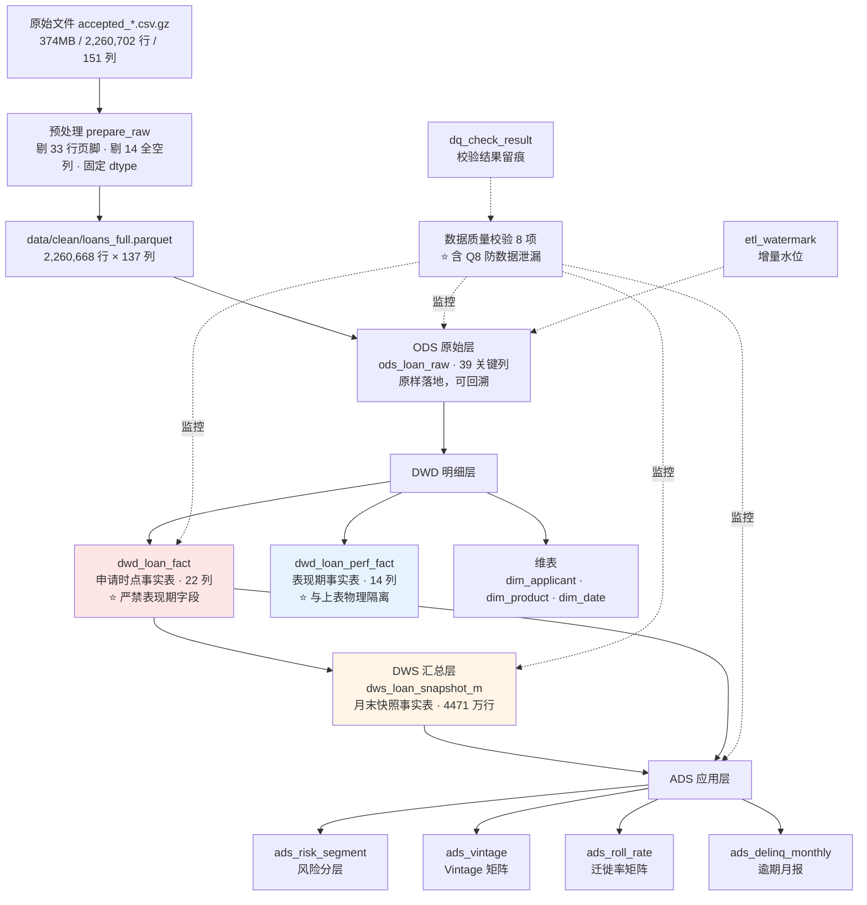
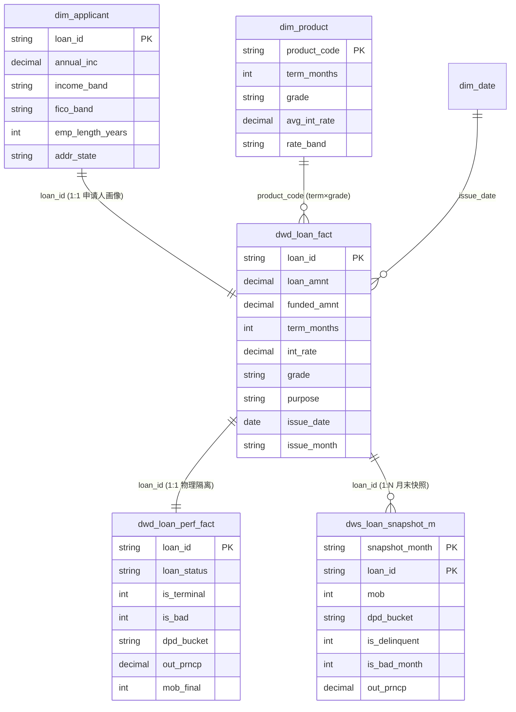

# 数仓设计文档

> **项目**：信贷离线数仓（credit-dwh）
> **数据源**：LendingClub 公开数据集 `accepted_2007_to_2018Q4`
> **规模**：2,260,668 行 × 137 列（实测）
> **建表**：13 张，DDL 见 `sql/ddl/01_schema.sql`
> **版本**：v1.0 ｜ 2026-09-17

---

## 1. 设计目标与约束

### 1.1 目标

把原始信贷放款流水加工成一套能回答以下问题的数据底座：

| 业务问题 | 对应产出 |
|---|---|
| 这笔贷款会不会逾期？ | 风险分层（`ads_risk_segment`） |
| 哪批客户质量在恶化？ | Vintage 矩阵（`ads_vintage`） |
| 风险会往哪个方向走？ | 迁徙率矩阵（`ads_roll_rate`） |
| 当前风险敞口有多大？ | 期末未偿余额（`dws_loan_snapshot_m`） |

### 1.2 约束

| 约束 | 影响 |
|---|---|
| 仅含**已放款**样本 | 存在幸存者偏差；批准率不可算 |
| `member_id` **整列为空** | 无法建客户维 |
| 状态为**最终快照**，无逐月历史 | 严格迁徙率不可算，需规则推导 |
| 14 个字段**整列为空** | 整列剔除（151 → 137） |
| 单机 MySQL | 需要考虑大表写入与索引代价 |

---

## 2. 分层架构



### 2.1 各层职责

| 层 | 表 | 粒度 | 职责 | 关键设计 |
|---|---|---|---|---|
| **ODS** | `ods_loan_raw` | 一行一笔 | 原样落地，可回溯 | 只存 39 个关键列，不做全量备份 |
| **DWD** | `dwd_loan_fact` | 一行一笔 | **申请时点**事实 | ⭐ 22 列，物理上不含表现期字段 |
| **DWD** | `dwd_loan_perf_fact` | 一行一笔 | **表现期**事实 | ⭐ 与上表物理隔离 |
| **DIM** | `dim_applicant` 等 3 张 | 见下 | 描述性属性 | 申请人画像维，粒度 = 一笔贷款 |
| **DWS** | `dws_loan_snapshot_m` | 一笔 × 一个月末 | 状态演化（周期快照） | 支撑 Vintage 与迁徙率 |
| **ADS** | 4 张指标表 | 见下 | 面向应用 | 直接给分析/报表用 |
| **OPS** | `etl_watermark` 等 2 张 | — | 运维与质量 | 增量水位 + 校验留痕 |

---

## 3. 表清单

### 3.1 ODS 层

| 表 | 粒度 | 列数 | 说明 |
|---|---|---|---|
| `ods_loan_raw` | 一行 = 一笔贷款 | 39 | 原样落地。含 `etl_load_time` 记录装载时间 |

### 3.2 DWD 层

| 表 | 粒度 | 列数 | 说明 |
|---|---|---|---|
| `dwd_loan_fact` | 一行 = 一笔贷款 | 22 | **申请时点信息** + `dq_level` 质量等级 |
| `dwd_loan_perf_fact` | 一行 = 一笔贷款 | 14 | **表现期信息** + 派生标签 |

**`dwd_loan_fact` 字段**：
```
loan_id, loan_amnt, funded_amnt, term_months, int_rate, installment,
grade, sub_grade, emp_length_years, home_ownership, annual_inc,
verification_status, purpose, addr_state, dti, fico_low, fico_high,
issue_date, issue_month, vintage, dq_level, etl_load_time
```

**`dwd_loan_perf_fact` 字段**：
```
loan_id, loan_status, is_terminal, is_bad, dpd_bucket,
total_rec_prncp, total_rec_int, recoveries, out_prncp, total_pymnt,
last_pymnt_d, last_pymnt_amnt, mob_final, etl_load_time
```

### 3.3 维度表

| 表 | 粒度 | 行数 | 主键 | 说明 |
|---|---|---|---|---|
| `dim_applicant` | 一行 = 一笔贷款 | 2,260,668 | `loan_id` | 🆕 **申请人画像维**（非客户维） |
| `dim_product` | 一行 = 期限×评级 | 14 | `product_code` | 产品维 |
| `dim_date` | 一行 = 一天 | 4,383 | `date_key` | 日期维（2008-01 ~ 2019-12） |

### 3.4 DWS 层

| 表 | 粒度 | 行数 | 主键 | 说明 |
|---|---|---|---|---|
| `dws_loan_snapshot_m` | 一笔贷款 × 一个观测月末 | **44,718,091** | `(snapshot_month, loan_id)` | 周期快照事实表 |

**字段**：`loan_id, snapshot_month, snapshot_date, issue_month, mob,
months_since_last_pymnt, dpd_bucket, is_delinquent, is_bad_month,
out_prncp, total_rec_prncp, loan_amnt, grade, etl_load_time`

### 3.5 ADS 层

| 表 | 粒度 | 行数 | 说明 |
|---|---|---|---|
| `ads_risk_segment` | 分层维度 × 取值 | 18 | 按评级/收入/FICO 分层 |
| `ads_vintage` | 批次 × 评级 × 账龄 | 24,768 | Vintage 累计不良率 |
| `ads_roll_rate` | 期初月 × 期初档 × 期末档 | 108 | 迁徙率（最近 12 个月） |
| `ads_delinq_monthly` | 批次 × 账龄 | 3,105 | 逾期月报 |

### 3.6 运维表

| 表 | 说明 |
|---|---|
| `etl_watermark` | 增量水位：记录每个任务处理到哪个月 |
| `dq_check_result` | 质量校验结果，带 `batch_id` 可追溯 |

---

## 4. 星型模型



> ⚠️ **注意本模型没有"客户维"**：`member_id` 整列为空（实测 2,260,668 行非空值 = 0），
> 不存在识别同一客户的键，因此**不虚构客户主键**，
> 改以申请人画像维（粒度 = 一笔贷款）承载申请时点属性。

---

## 5. ⭐ 关键设计决策与理由

| # | 决策点 | 选择 | 理由 | 放弃的方案及原因 |
|---|---|---|---|---|
| 1 | **星型 vs 雪花** | **星型** | 分析场景查询更快、结构更易理解 | ❌ 雪花：JOIN 层级多，分析无收益 |
| 2 | **事实表类型** | 事务事实表 + **周期快照** | 前者记申请，后者记状态演化 | — |
| 3 | **历史追踪** | **月末快照事实表** | 数据真实可校验；天然支撑 Vintage 与迁徙率 | ❌ **SCD2 拉链表**：本数据是放款时点静态快照，无真实属性变更序列，硬做只能造假数据（详见 §6.1） |
| 4 | **防数据泄漏** | **申请时点/表现期物理分表** + 字段黑名单自动校验 | 从结构上杜绝误用，不靠自觉 | ❌ 仅文档标注：靠人记，必然出错 |
| 5 | **维度设计** | **申请人画像维**（粒度=一笔贷款） | `member_id` 整列为空，无客户识别键 | ❌ 客户维：缺主键；❌ 伪客户 ID：错误关联 |
| 6 | **分区策略** | 按放款月 `issue_month` | 便于增量加工与批次回溯 | — |
| 7 | **表引擎** | InnoDB | 事务安全，支持行锁与崩溃恢复 | ❌ MyISAM：无事务，崩溃易损坏 |
| 8 | **快照表主键顺序** | **`(snapshot_month, loan_id)`** | 与"按月批量写入"顺序一致 → 聚簇索引顺序追加 | ❌ `(loan_id, snapshot_month)`：随机写，吞吐从 40k 衰减到 5k 行/秒（详见 §6.2） |
| 9 | **排序规则** | 全库统一 `utf8mb4_0900_ai_ci` | 避免跨表 JOIN 报 `ERROR 1267` | ❌ 混用 collation：JOIN 直接被拒 |
| 10 | **列名** | **全部加反引号** | 免疫 MySQL 保留字（如 `year_month`） | ❌ 裸列名：`ERROR 1064` |

---

## 6. 两个关键决策的详细说明

### 6.1 为什么用月末快照，而不是 SCD2 拉链表

**v1.0 的原设计**：建 `dim_customer_scd2` 拉链表，记录客户评级/收入的历史变化。

| 字段 | 说明 |
|---|---|
| `start_date` / `end_date` | 该属性版本的生效区间 |
| `is_current` | 是否当前有效 |

**为什么放弃**：

本数据集是**放款时点的静态快照** —— `annual_inc`（年收入）、`grade`（评级）
都只有"申请那一刻"的值，**没有历史切片**。

也就是说：**根本拿不到"这个客户 3 年前收入多少"的数据。**
硬做拉链表只能**人为造几条假数据**来演示。一旦面试官问"你的 SCD2 数据从哪来的"，
项目可信度会瞬间崩塌。

**替代方案：月末快照事实表（周期快照）**

| 字段 | 说明 |
|---|---|
| `snapshot_month` | 观测月末（如 `2018-06`） |
| `mob` | 账龄 = 观测月 − 放款月 |
| `dpd_bucket` | 该月末的逾期档位 |
| `out_prncp` | 期末未偿本金 |

**它为什么更好**：

1. 它是**标准数仓模式**（周期快照事实表），不是妥协方案
2. **数据真实可校验** —— 每个字段都能追溯到原始数据
3. **天然支撑 Vintage 与迁徙率** —— 比拉链表更贴信贷业务
4. 行数可控（`MOB_MAX = 24` → 4471 万行）

> 🔑 **面试话术**：
> "我原本打算做客户属性拉链表，但发现这份数据是放款时点的静态快照，
> 不存在真实的属性变更序列，硬做出来是假的。
> 我改成了月末快照事实表 —— 同样是标准数仓模式，同样解决历史状态追踪，
> 但**数据是真实的、可校验的**，而且它天然支撑了 Vintage 分析。"

### 6.2 快照表主键顺序：一个 12 倍的性能差异

**问题**：快照表最初主键是 `(loan_id, snapshot_month)`，但数据是**按观测月批量写入**的：

```
先插 2015-08 的全部贷款
再插 2015-09 的全部贷款
...
```

**后果**：同一笔贷款的不同月份记录，在 InnoDB 聚簇索引里**分散在很远的位置**。
每次插入都要在索引中间"塞"，造成**随机 I/O + 页分裂**。

**实测对比**：

| 主键 | 吞吐 | 480 万行耗时 |
|---|---|---|
| `(loan_id, snapshot_month)` | 5,379 行/秒（**持续衰减**） | 26 分钟 |
| **`(snapshot_month, loan_id)`** | **38,032 行/秒（恒定）** | **4.2 分钟** |
| 全量 4471 万行 | 33,296 行/秒 | 灌数 22.4 分钟 |

**另一个优化**：灌数前**先删二级索引**，灌完再重建。
逐行维护 4 个索引会让吞吐再降一半；一次性重建是顺序构建，快得多。

> 🔑 **面试价值**：这说明你理解"**聚簇索引的物理顺序影响写入性能**"，
> 而不只是会写 SQL。

---

## 7. 数据质量等级规则

`dwd_loan_fact` 中的 `dq_level` 字段标记每行数据质量：

| 等级 | 触发条件 | 处理 |
|---|---|---|
| `PASS` | 全部校验通过 | 正常使用 |
| `WARN` | 金额/利率/评级等存在轻微异常 | 保留，但分析时可过滤 |
| `REJECT` | 主键缺失 / 金额非法 / 日期非法 | **不写入 DWD**，需登记原因 |

**实测结果**：全量 2,260,668 行中 `REJECT` 为 **0 行**
（早期版本以为有 32 行缺失，实测证明那是页脚行，已在预处理阶段剔除）。

---

## 8. 与早期设计的差异说明

本文档相对 v1.0 规划的关键变更，均基于**实测数据**：

| 项 | v1.0 规划 | 实测后的设计 | 变更原因 |
|---|---|---|---|
| 客户维 | `dim_customer` | **`dim_applicant`** | `member_id` 整列为空 |
| 历史追踪 | SCD2 拉链表 | **月末快照事实表** | 无真实属性变更序列 |
| 字段数 | 151 | **137** | 14 列整列为空 |
| 真实行数 | 2,260,700 | **2,260,668** | 33 行页脚（非 1 行） |
| 批准率 | 列为指标 | **删除** | 分母不存在 |
| 事实表结构 | 单张事实表 | **申请时点/表现期分两张** | 防数据泄漏 |
| 快照主键 | `(loan_id, month)` | **`(month, loan_id)`** | 写入性能差 12 倍 |
