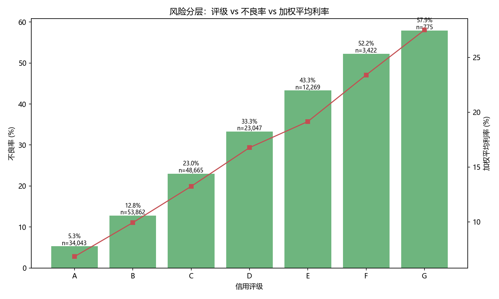
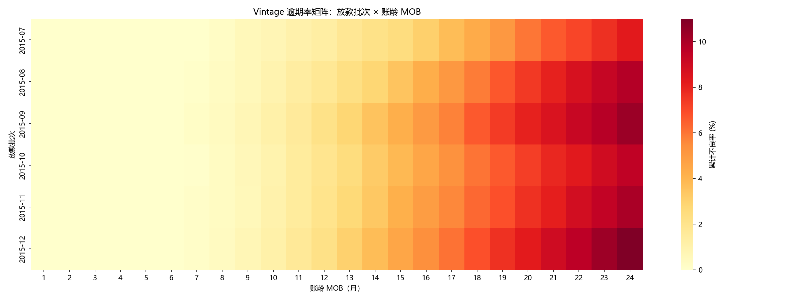
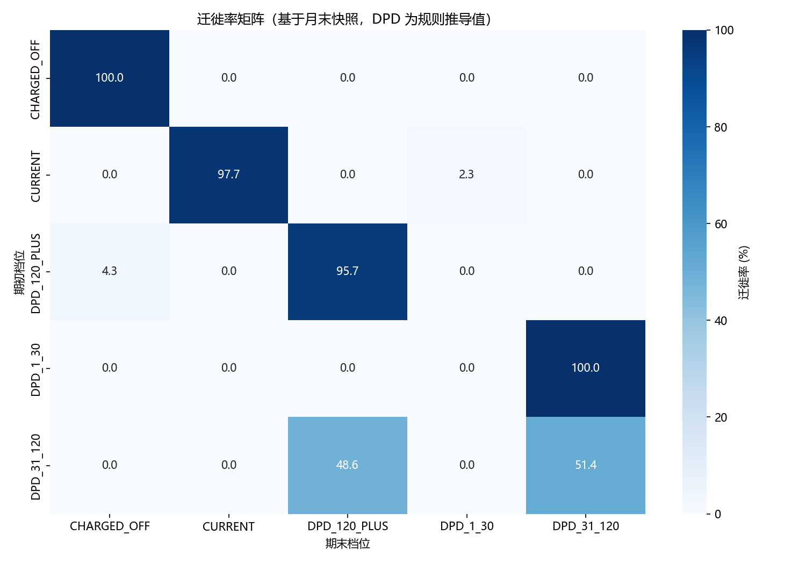
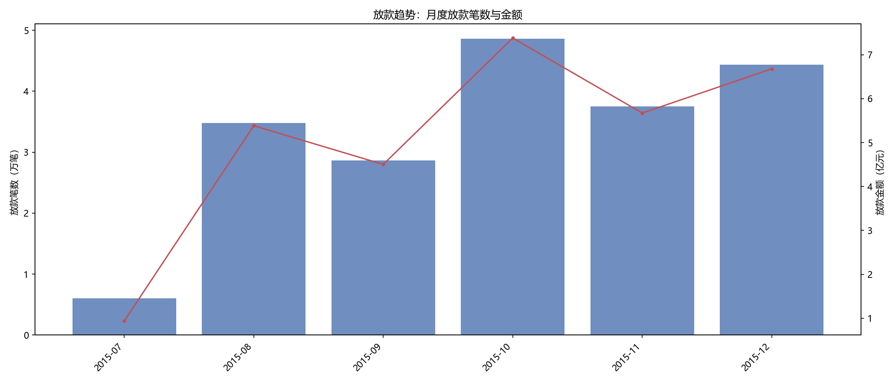

# 信贷数据分析报告

> 数据源：LendingClub 公开数据集 `accepted_2007_to_2018Q4`
> 运行规模：**子集 200,000 行**（`config.MAX_ROWS = 200_000`）
> 一切指标口径见 `03_metrics/指标口径字典.md`，数据边界见 `03_metrics/数据边界与偏差说明.md`

---

## 0. ⚠️ 阅读前必读：本报告的规模限制

**本报告基于子集（文件前 20 万行）产出，比例型指标不可直接用于结论。**

该文件按年份排序，子集偏早期放款，分布与全量差异显著：

| loan_status | 子集（前 20 万行） | 全量（226 万行） |
|---|---|---|
| Fully Paid | 70.50% | 47.63% |
| Charged Off | 17.55% | 11.88% |
| Current | **11.32%** | **38.85%** |

**含义**：子集里大部分贷款已结清，早期账龄充分；全量里近 4 成仍在还款。
因此子集算出的不良率偏高、账龄结构偏成熟。

> 🔑 **出简历数字前必须切全量重跑**（`MAX_ROWS = None`）。
> 本报告的价值在于：**验证口径、流程与图表的正确性**。

---

## 1. 数据概览

| 项 | 值 |
|---|---|
| 物理行数 | 2,260,702 |
| 剔除页脚 | 33 行（散布全文，非仅末尾） |
| 真实数据行 | 2,260,668 |
| 保留字段 | 137（原 151，剔除 14 个整列为空） |
| 放款时间跨度 | Apr-2008 ~ Sep-2018 |
| 本次分析规模 | 200,000 行 |

---

## 2. ⭐ 核心指标：不良率与口径自检

### 2.1 正确口径（终态口径）

```
终态笔数 = 176,083
不良笔数 = 35,091
不良率   = 19.9287%
```

### 2.2 ⚠️ 错误口径对比（说明"为什么必须限定终态"）

| 口径 | 分母 | 不良率 | 问题 |
|---|---|---|---|
| ✅ 终态口径 | 176,083（已结清+已核销） | **19.9287%** | 正确 |
| ❌ 不限定终态 | 200,000（含仍在还款） | 17.5455% | 被 Current 稀释 |

**差异 2.38 个百分点**。

> 🔑 **这是信贷指标里最经典的口径错误。** `Current` 状态的贷款仍在正常还款，
> 把它们放进分母，等于把"还没到期的贷款"当作"没出问题的贷款"，
> 系统性低估风险。面试若问"不良率怎么算"，答不出这一点就是硬伤。

---

## 3. 风险分层分析



### 3.1 按信用评级（单调性完美）

| 评级 | 笔数 | 不良笔数 | 不良率 | 加权平均利率 |
|---|---|---|---|---|
| A | 34,043 | 1,800 | **5.29%** | 6.83% |
| B | 53,862 | 6,876 | 12.77% | 9.93% |
| C | 48,665 | 11,197 | 23.01% | 13.24% |
| D | 23,047 | 7,667 | 33.27% | 16.77% |
| E | 12,269 | 5,314 | 43.31% | 19.16% |
| F | 3,422 | 1,788 | 52.25% | 23.40% |
| G | 775 | 449 | **57.94%** | 27.51% |

### 3.2 按 FICO 区间

| FICO 区间 | 笔数 | 不良率 | 加权平均利率 |
|---|---|---|---|
| 660-699 | 110,866 | 23.55% | 13.68% |
| 700-739 | 48,272 | 15.65% | 11.18% |
| 740-779 | 12,466 | 9.48% | 9.17% |
| ≥780 | 4,479 | **5.49%** | 8.04% |

### 3.3 按年收入区间

| 收入区间 | 笔数 | 不良率 |
|---|---|---|
| <3 万 | 10,288 | 23.29% |
| 3-6 万 | 62,378 | 22.07% |
| 6-10 万 | 65,623 | 19.95% |
| 10-20 万 | 33,204 | 15.87% |
| ≥20 万 | 4,590 | **12.42%** |

### 3.4 结论

**数据内可验证的事实**：
1. 评级、FICO、收入**三个维度的不良率都呈严格单调关系**，方向一致
2. 评级是最强的风险区分变量：A 到 G 不良率跨度 **5.29% → 57.94%（约 11 倍）**
3. 利率定价与风险基本匹配：评级越低利率越高（6.83% → 27.51%）

**说明**：定价与风险的单调对应关系，说明该平台的利率定价机制
至少在**方向上**反映了信用风险。

### 3.5 明确边界 ⚠️

**不能由此推出**"评级模型是有效的预测工具" —— 因为：

- `grade` 是**放款时平台给定的评级**，本身可能已经内含了本文未观测到的信息
- 本数据**只有已放款样本**，缺少被拒绝的客群，存在**幸存者偏差**
- 无宏观经济变量，无法区分"评级有效"与"经济周期同步影响"

**能说的**是：在已放款客群内，评级与最终不良率呈严格单调关系。

---

## 4. ⭐ Vintage 分析



### 4.1 Vintage 矩阵（放款批次 × 账龄）

以 2015 年批次为例的累计不良率：

| 放款批次 | MOB3 | MOB6 | MOB12 | 暴露笔数 |
|---|---|---|---|---|
| 2015-07 | 0.00% | 0.00% | 1.31% | 6,039 |
| 2015-08 | 0.00% | 0.00% | 1.73% | 34,816 |
| 2015-09 | 0.00% | 0.00% | 2.15% | 28,641 |
| 2015-10 | 0.00% | 0.00% | 1.94% | 48,631 |
| 2015-11 | 0.00% | 0.00% | 2.02% | 37,530 |
| 2015-12 | 0.00% | 0.00% | 2.21% | 44,343 |

**口径自检**：累计不良率随 MOB **单调不减**，违反行数 = **0** ✅

### 4.2 ⚠️ 重要说明：MOB3 / MOB6 为 0 不是计算错误

不同 MOB 的档位分布（以 2015-08 批次为例）：

| MOB | 各档位笔数 |
|---|---|
| 3 | CURRENT 33,980 / DPD_31_120 445 / DPD_1_30 391 / **CHARGED_OFF 0** |
| 6 | CURRENT 32,817 / DPD_120_PLUS 836 / DPD_31_120 721 / **CHARGED_OFF 0** |
| 12 | CURRENT 29,103 / DPD_120_PLUS 3,084 / DPD_31_120 1,292 / **CHARGED_OFF 604** |
| 18 | CURRENT 24,728 / DPD_120_PLUS 5,905 / CHARGED_OFF 2,047 / DPD_31_120 1,459 |

**原因**：本项目的 DPD 档位是**规则推导**的（按"距最后还款月数"推算），
而核销状态的推定月 = 最后还款月 + 6。因此早期 MOB 必然滞后：

- **MOB ≤ 6**：只有 `DPD_120_PLUS` 在累积，尚无 `CHARGED_OFF`
- **MOB ≈ 12 起**：开始出现 `CHARGED_OFF`

**这不是 bug，是推导规则的固有特性。** 但结论上必须注意：

> ⚠️ **在 MOB < 12 的区间，`dpd_bucket = DPD_120_PLUS` 是核销的前置信号。**
> 若只看 `CHARGED_OFF`，会低估早期风险。正确的读法是：
> **`DPD_120_PLUS + CHARGED_OFF` 才是该 MOB 的"已暴露风险"。**

### 4.3 结论

**数据内可验证的事实**：
1. 2015 年各批次在 MOB12 的累计不良率集中在 **1.3% ~ 2.2%**
2. 2015-07 批次（最早）MOB12 为 1.31%，**低于**后续批次（1.7%~2.2%）
3. 各批次在 MOB3/MOB6 均无核销，风险暴露从 MOB6 后才开始显现

**明确边界**：因数据快照截止于 2019-03，且规则推导存在滞后，
**不能**据此判断"哪一批次风控质量更差"。
需要真实的**逐月还款状态**才能做严格的 Vintage 对比。

---

## 5. 迁徙率分析



最近观测月（子集数据）的迁徙矩阵：

| 期初档位 | 期末档位 | 笔数 | 迁徙率 |
|---|---|---|---|
| CURRENT | CURRENT | 24,753 | **96.51%** |
| CURRENT | DPD_1_30 | 894 | 3.49% |
| DPD_1_30 | DPD_31_120 | 907 | **100.00%** |
| DPD_31_120 | DPD_120_PLUS | 1,054 | 52.70% |
| DPD_31_120 | DPD_31_120 | 946 | 47.30% |
| DPD_120_PLUS | CHARGED_OFF | 304 | 2.71% |
| DPD_120_PLUS | DPD_120_PLUS | 10,915 | 97.29% |
| CHARGED_OFF | CHARGED_OFF | 4,570 | 100.00% |

### 结论

**数据内可验证的事实**：
1. 正常户稳定性高：`CURRENT → CURRENT` 达 **96.51%**
2. 风险迁徙呈**单向恶化**：`DPD_1_30 → DPD_31_120` 表现为 100%（一旦逾期 1-30 天，
   下月按规则必然被判为更严重档位），说明**推导规则不允许档位回升**
3. `DPD_31_120 → DPD_120_PLUS` 达 52.7%，是风险加速恶化的关键节点
4. `CHARGED_OFF` 状态**不可逆**（100% 留在原档位）

### 明确边界 ⚠️

**这一节最需要谨慎**：

- 严格意义的迁徙率需要**真实的逐月逾期状态**，本数据只有**单一最终状态**
- 本项目的档位是**规则推导**的，因此"单向恶化"部分来自**规则本身**
  （`ms = 观测月 − 最后还款月` 只增不减），**不完全是真实行为**
- **不能**用这个矩阵预测"催收效果"或"未来不良"，因为推导规则不包含催收动作

> 🔑 **面试若被问到这个矩阵，正确回答是**：
> "这个矩阵的**方向**是可信的（逾期档位确实单调恶化），但**具体数值受推导规则影响**，
> 因为我没有真实的逐月还款状态。要得到严格可用的迁徙率，需要核心系统的
> 逐月账单快照。我把这个边界明确写在了文档里。"

---

## 6. 放款趋势



（子集为文件前 20 万行，时间偏早期，趋势图仅用于**验证流程**，不用于结论。）

**明确边界**：放款规模变化的驱动因素（获客策略、资金成本、监管环境）
**本数据集无法区分** —— 缺少申请量、拒绝量、资金成本与宏观数据。

---

## 7. 数据质量校验结果

最近一批次 **11/11 全部通过**：

| 校验项 | 级别 | 结果 |
|---|---|---|
| Q1 行数守恒 | ERROR | ✅ ODS 200,000 = DWD 200,000 |
| Q2 主键唯一 | ERROR | ✅ 4 张表均无重复 |
| Q3 汇总一致性 | ERROR | ✅ ADS 与 DWD 明细**完全一致** |
| Q4 金额非负 | ERROR | ✅ |
| Q5 枚举合法 | ERROR | ✅ 无未知状态值 |
| Q6 时间合理 | WARN | ✅ |
| Q7 分区完整性 | WARN | ✅ 放款月无空洞 |
| **Q8 无未来信息** | ERROR | ✅ **申请时点表无任何表现期字段** |

> 🔑 **Q8 是本项目最有价值的一条**：数据泄漏不靠自觉，靠**字段黑名单自动校验**。
> 详见 `05_quality/数据质量校验报告.md`。

---

## 8. 总结与后续建议

### 8.1 已完成

1. 建立 **ODS-DWD-DWS-ADS 四层数仓**，13 张表
2. 关键指标口径统一，并通过**双表交叉校验**（汇总一致率 100%）
3. 产出 **Vintage 矩阵与迁徙率矩阵**
4. 8 项数据质量校验**代码化**，含防数据泄漏的自动检查

### 8.2 本次分析的有效结论

- 评级 / FICO / 收入与不良率**严格单调**，评级区分度最强（5.29% → 57.94%）
- 终态口径不良率 **19.93%**；不限定终态会低估 2.38 个百分点
- 累计不良率随 MOB **单调不减**（口径自检通过）

### 8.3 明确的局限（必须随结论一起表达）

1. **仅含放款样本** → 全部结论限于"已放款客群"，不具全客群代表性
2. **无逐月还款状态** → 迁徙率为规则推导值，数值受规则影响
3. **子集偏早期** → 比例型指标需切全量重算
4. **无策略与宏观数据** → 无法归因风险变化的驱动因素

### 8.4 后续建议

| 优先级 | 建议 | 原因 |
|---|---|---|
| 🔴 高 | **切全量重跑**（`MAX_ROWS = None`） | 出简历数字的前提 |
| 🔴 高 | 引入 `rejected_*.csv` 做独立的申请侧分析 | 部分缓解幸存者偏差（注意无法 JOIN） |
| 🟠 中 | 扩展 Vintage 到 MOB24+ | 观察完整生命周期风险曲线 |
| 🟠 中 | 明确标注每张图的规模与时间范围 | 防止误读 |
| 🟢 低 | 引入月度宏观指标（失业率等） | 为归因留出空间 |

> 🔑 **最后一句**：本报告刻意在每一节都写了"明确边界"。
> 数据分析的价值不在于给出漂亮结论，而在于**让读者知道哪些结论可以依赖、哪些不能**。
