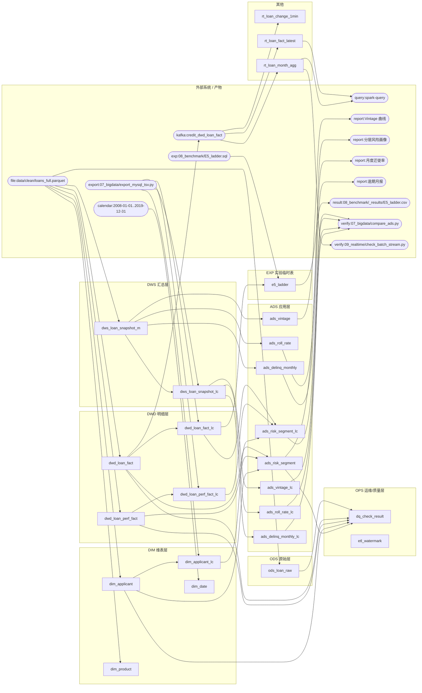

# 数据血缘图

> 由 `docs/gen_lineage.py` 从 `docs/lineage.yaml` 自动生成，**不要手改**。
> 生成：`python docs/gen_lineage.py` ｜ 校验：`python docs/gen_lineage.py --check`
> 元数据按**代码实测**登记，不是照抄文档模板（见文末「读图须知」）。

共登记 **25** 个节点：已实现 **25** 个、规划中 **0** 个。

## 分层清单

| 表 | 层 | 上游 | 下游 | SLA | 说明 |
|---|---|---|---|---|---|
| `ods_loan_raw` | ODS | file:data/clean/loans_full.parquet | dq_check_result | T+1 07:30 | 由 src/ods_load.py 从干净 Parquet 装载；与 DWD 同源扇出，是留证/回滚点 |
| `dwd_loan_fact` | DWD | file:data/clean/loans_full.parquet | ads_risk_segment dq_check_result dwd_loan_fact_lc kafka:credit_dwd_loan_fact | T+1 08:00 | 申请时点事实表（32 个申请字段 + 派生列），不含任何表现期字段（Q8 校验）；同时经 Flink CDC 进入实时链路 |
| `dwd_loan_perf_fact` | DWD | file:data/clean/loans_full.parquet | ads_risk_segment dq_check_result dwd_loan_perf_fact_lc | T+1 08:00 | 表现期事实表，is_bad / is_terminal 在此固化 |
| `dim_applicant` | DIM | file:data/clean/loans_full.parquet | ads_risk_segment dq_check_result dim_applicant_lc | — | loan_id 唯一；income_band / fico_band 分档在此生成 |
| `dim_product` | DIM | file:data/clean/loans_full.parquet | — | — | product_code = 期限_评级；已建但未进 ADS 汇总（诚实空白） |
| `dim_date` | DIM | calendar:2008-01-01..2019-12-31 | — | — | ⚠️ 仅覆盖 2008-01 起，覆盖不到最早 6 个月 603 笔贷款（阶段三不依赖） |
| `dws_loan_snapshot_m` | DWS | file:data/clean/loans_full.parquet | ads_vintage ads_roll_rate ads_delinq_monthly dws_loan_snapshot_lc | T+1 09:00 | 放款月 × 观测月的月末快照长表，mob <= 24 |
| `ads_risk_segment` | ADS | dwd_loan_fact dwd_loan_perf_fact dim_applicant | dq_check_result report:分层风险画像 | — | 18 行 / 3 个 dim_type（grade / income_band / fico_band），均只算终态 |
| `ads_vintage` | ADS | dws_loan_snapshot_m | report:Vintage 曲线 | — | 24,768 行 |
| `ads_roll_rate` | ADS | dws_loan_snapshot_m | report:月度迁徙率 | — | 108 行；口径归一自检见 07_bigdata/hive/08_ads_selfcheck.sql |
| `ads_delinq_monthly` | ADS | dws_loan_snapshot_m | report:逾期月报 | — | 3,105 行 |
| `etl_watermark` | OPS | — | — | — | 增量幂等水位表（阶段二），阶段三全量链未使用 |
| `dq_check_result` | OPS | ods_loan_raw dwd_loan_fact dwd_loan_perf_fact dim_applicant ads_risk_segment | — | — | 8 条规则 11 项校验结果落库（src/dq_check.py） |
| `dwd_loan_fact_lc` | DWD(Hive, ORC, 分区 issue_month ×139) | dwd_loan_fact export:07_bigdata/export_mysql_tsv.py | ads_risk_segment_lc e5_ladder | — | 装载走 stg_loan_fact(临时表) → REPARTITION(20, issue_month)，141 分区各 1 文件 |
| `dwd_loan_perf_fact_lc` | DWD(Hive, ORC) | dwd_loan_perf_fact export:07_bigdata/export_mysql_tsv.py | ads_risk_segment_lc | — | 非分区表 |
| `dws_loan_snapshot_lc` | DWS(Hive, ORC, 分区 snapshot_month) | dws_loan_snapshot_m export:07_bigdata/export_mysql_tsv.py | ads_vintage_lc ads_roll_rate_lc ads_delinq_monthly_lc | — |  |
| `dim_applicant_lc` | DIM(Hive, ORC) | dim_applicant export:07_bigdata/export_mysql_tsv.py | ads_risk_segment_lc | — |  |
| `ads_risk_segment_lc` | ADS(Hive, ORC) | dwd_loan_fact_lc dwd_loan_perf_fact_lc dim_applicant_lc | verify:07_bigdata/compare_ads.py | — | 18 行，与 MySQL 侧逐行一致 |
| `ads_vintage_lc` | ADS(Hive, ORC) | dws_loan_snapshot_lc | verify:07_bigdata/compare_ads.py | — |  |
| `ads_roll_rate_lc` | ADS(Hive, ORC) | dws_loan_snapshot_lc | verify:07_bigdata/compare_ads.py | — |  |
| `ads_delinq_monthly_lc` | ADS(Hive, ORC) | dws_loan_snapshot_lc | verify:07_bigdata/compare_ads.py | — |  |
| `e5_ladder` | EXP(Hive, 临时表) | dwd_loan_fact_lc exp:08_benchmark/E5_ladder.sql | result:08_benchmark/_results/E5_ladder.csv | — | E5 数据量阶梯（10%/25%/100%），loan_id % N = 0 两引擎同谓词 |
| `rt_loan_fact_latest` | RT(Paimon 主键表) | kafka:credit_dwd_loan_fact | query:spark-query | — | 变更日志（debezium-json）镜像最新状态；额外带 sink_ts 用于端到端延迟测量（实测 ≈310 ms） |
| `rt_loan_change_1min` | RT(Paimon 窗口聚合) | kafka:credit_dwd_loan_fact | — | — | 1 分钟滚动窗口（事件时间 + Watermark，允许乱序 5s）。⚠️ 语义是「该窗口内发生过变更的贷款」而非「新增放款笔数」—— 输入是 changelog，UPDATE 会把行从旧窗口移到新窗口 |
| `rt_loan_month_agg` | RT(Paimon 指标表) | kafka:credit_dwd_loan_fact | verify:09_realtime/check_batch_stream.py query:spark-query | — | ⭐ 按放款月维护的 upsert 聚合，是批流对账的实时侧。与 dwd_loan_fact 逐月对账：139 个月、笔数差 0、金额差 0.00（判定规则见 docs/SLA与监控.md §5.3）；另由 Spark 只读直读（M4） |

## 读图须知（诚实说明）

1. **MySQL 层是扇出，不是串接**：`ods_loan_raw` / `dwd_*` / `dim_*` / `dws_*` 都直接读同一份 `data/clean/loans_full.parquet`（`src/utils.py::read_clean`）。所以 ODS 表是**留证 / 回滚点，不是 DWD 的输入** —— 生产里通常是 ODS→DWD 串接，这里为了单机可重跑改成了同源扇出，被问到要如实讲。
2. **Hive 层才是真正的串接**：`*_lc` 表由 MySQL 表经 `07_bigdata/export_mysql_tsv.py` 导出 TSV 后装载；4 张 `ads_*_lc` 由 Hive 表在库内计算得出。
3. `dim_product` / `dim_date` 目前**没有下游**（已建但未进 ADS 汇总），这是诚实的空白，不在图里编下游。
4. `e5_ladder` 等 `e4_*` / `e5_*` 是实验用的**临时表**，由 `08_benchmark/run_experiment.py` 按 `08_benchmark/exp/*.sql` 建；这里只登记被血缘引用到的 `e5_ladder`。
