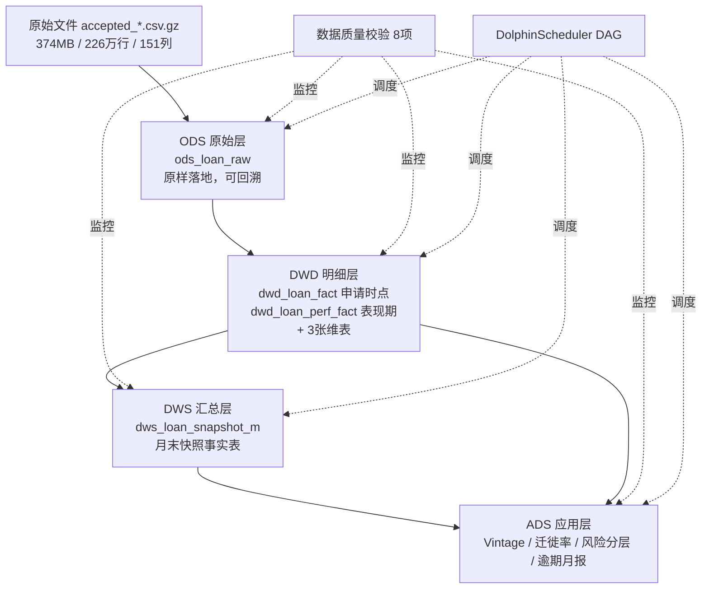
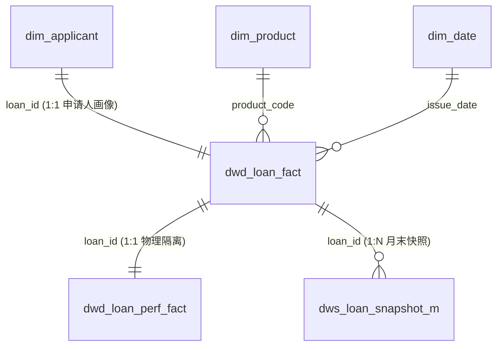

# 项目从零开始指导书 —— 金融/信贷离线数仓 全流程实现手册

> **配套文档**：`v1.1_Project.md`（回答"做什么、为什么"）｜ 本文档回答"**具体怎么一步步做**"
> 生成日期：2026-09-12
> 适用对象：SQL 会窗口函数、Python 能看懂、数仓零基础
> 技术栈：Windows 11 + Docker + Ubuntu 容器 + Python 3.11 + MySQL 8 + DolphinScheduler + Git
> 预计总投入：**阶段二约 100 小时**
> 数据实况（**本地实测**）：`accepted_2007_to_2018Q4.csv.gz`，374.4 MB，**2,260,701 行含页脚，真实数据 2,260,700 行**，151 列

---

## 如何使用本指导书

| 你的状态 | 从哪开始 |
|---|---|
| 完全没开始 | 第 0 步 → 顺序往下 |
| 卡在某个报错 | 直接查 **附录 C 排错手册** |
| 想知道某步做到什么程度算完成 | 每步末尾的 **✅ 验收标准** |
| 想快速看全貌 | 先读 **§0.3 全景流程图** |

### 三条使用规则

1. **每步的"✅ 验收标准"没通过，不许进入下一步。** 这是本项目唯一强制的纪律。
2. **代码不要复制后就跑，先读懂再跑。** 面试官会问你每一行的意图。
3. **每步完成后立刻提交 Git。** commit message 用 `feat:`/`fix:`/`docs:` 前缀。

---

## 第 0 步：环境搭建（约 4 小时）

### 0.1 你的环境现状（已实测）

| 组件 | 状态 | 版本 | 结论 |
|---|---|---|---|
| Python | ✅ 可用 | 3.11.8 | 直接用 |
| Git | ✅ 可用 | 2.49.0 | 直接用 |
| Docker | ✅ 可用 | 29.2.1 | **作为 Linux 环境主力** |
| WSL2 | ❌ **不可用** | `E_ACCESSDENIED`（需管理员权限） | **放弃，改用 Docker** |
| MySQL | ❓ 未检测 | — | 用 Docker 起 |

> ⚠️ **重要判断**：你的机器上 **WSL 需要管理员权限而无法启用**。不要在这上面耗时间 —— 直接走 **Docker + Ubuntu 容器** 路线，效果等价（面试官关心的是"你会用 Linux"，不是"你用的是 WSL 还是 Docker"）。

### 0.2 环境方案决策

| 方案 | 采用 | 理由 |
|---|---|---|
| **Docker + Ubuntu 容器**（挂载项目目录） | ✅ **主力** | 无需管理员权限、环境干净、可复现、可写进 README |
| Docker + MySQL 容器 | ✅ **主力** | 同上 |
| WSL2 | ❌ 放弃 | 权限受限 |
| 云服务器 | 🔜 阶段三再用 | 跑 Hive 时需要，阶段二不必花钱 |

### 0.3 全景流程图

```
                      ┌──────────── 阶段二（本项目主体）────────────┐
                      │                                            │
 [原始 gz 文件]        │  ┌──────┐   ┌──────┐   ┌──────┐   ┌──────┐│
  374MB / 226万行  ────┼─▶│ ODS  │──▶│ DWD  │──▶│ DWS  │──▶│ ADS  ││──▶ 分析报告
                      │  │原样落地│   │清洗派生│   │月末快照│   │指标表 ││    + README
                      │  └──────┘   └──────┘   └──────┘   └──────┘│    + 简历
                      │      │          │          │          │   │
                      │      └──────────┴──────────┴──────────┘   │
                      │                    │                       │
                      │            ┌───────────────┐               │
                      │            │ 数据质量校验  │ 8 项规则       │
                      │            └───────────────┘               │
                      │                    │                       │
                      │         ┌──────────────────────┐           │
                      │         │ DolphinScheduler DAG │ 6 任务     │
                      │         │ (依赖 + 重试 + 告警)  │           │
                      │         └──────────────────────┘           │
                      └────────────────────────────────────────────┘
                                          │
                                          ▼
                      ┌──────── 阶段三（引擎迁移 + 性能基准）────────┐
                      │  Hive 分区表 + PySpark + 倾斜处理 + 双引擎对比 │
                      └──────────────────────────────────────────────┘
```

### 0.4 操作：建立项目骨架

**在 PowerShell 中执行**（工作目录 `F:\BUPT\Internship_Preparation\Project`）：

```powershell
# 1. 创建目录骨架
$dirs = @(
  "01_eda","02_design","03_metrics","04_analysis\images","05_quality",
  "06_ops\dags","06_ops\shell","06_ops\logs",
  "data\raw","data\processed","data\mysql_init",
  "src","sql\ddl","sql\dq","docs"
)
foreach ($d in $dirs) { New-Item -ItemType Directory -Force -Path $d | Out-Null }
Get-ChildItem -Directory | Select-Object Name | Format-Table -AutoSize
```

**创建 `.gitignore`**（关键：不提交 374MB 原始数据）：

```gitignore
# 数据（绝不入库）
data/raw/
data/processed/
!data/mysql_init/
!data/.gitkeep

# Python
__pycache__/
*.py[cod]
.venv/
venv/
.ipynb_checkpoints/

# 日志与临时文件
*.log
06_ops/logs/
*.tmp
.DS_Store

# 本地配置
.env
config.local.py
```

**创建 `requirements.txt`**：

```text
pandas==2.2.2
numpy==1.26.4
SQLAlchemy==2.0.30
PyMySQL==1.1.1
cryptography==42.0.7
python-dateutil==2.9.0
matplotlib==3.9.0
seaborn==0.13.2
python-dotenv==1.0.1
```

**安装依赖**：

```powershell
python -m venv .venv
.\.venv\Scripts\Activate.ps1
pip install -r requirements.txt
```

### 0.5 操作：启动 Docker 环境

**创建 `docker-compose.yml`**：

```yaml
services:
  mysql:
    image: mysql:8.0
    container_name: credit-dwh-mysql
    restart: unless-stopped
    environment:
      MYSQL_ROOT_PASSWORD: root123456
      MYSQL_DATABASE: credit_dwh
      TZ: Asia/Shanghai
    command: >
      --character-set-server=utf8mb4
      --collation-server=utf8mb4_unicode_ci
      --local-infile=1
      --secure-file-priv=""
    ports:
      - "3306:3306"
    volumes:
      - mysql_data:/var/lib/mysql
    healthcheck:
      test: ["CMD", "mysqladmin", "ping", "-h", "localhost", "-proot123456"]
      interval: 10s
      timeout: 5s
      retries: 10

  ubuntu:
    image: ubuntu:22.04
    container_name: credit-dwh-linux
    restart: unless-stopped
    command: sleep infinity
    volumes:
      - ./:/workspace
    working_dir: /workspace
    environment:
      TZ: Asia/Shanghai

volumes:
  mysql_data:
```

**启动**：

```powershell
docker compose up -d
docker compose ps
```

**进入 Linux 环境并准备工具**：

```powershell
docker exec -it credit-dwh-linux bash

# 容器内执行（一次性）
apt-get update
apt-get install -y python3 python3-pip mysql-client gzip wget curl vim
ln -s /workspace /root/workspace 2>/dev/null
exit
```

**验证 MySQL 连通**：

```powershell
docker exec -it credit-dwh-mysql mysql -uroot -proot123456 -e "SHOW DATABASES; SELECT VERSION();"
```

### 0.6 操作：初始化 Git 仓库

```powershell
git init
git config user.name "你的名字"
git config user.email "你的邮箱"
New-Item -ItemType File -Force -Path README.md | Out-Null
git add .
git commit -m "chore: 初始化项目骨架与Docker环境"
```

**新建 GitHub 公开仓库**（命名 `credit-dwh`），然后：

```powershell
git remote add origin https://github.com/你的用户名/credit-dwh.git
git branch -M main
git push -u origin main
```

**验证 `.gitignore` 生效**（这一步必须做，否则可能误提交 374MB）：

```powershell
git status --short
# 输出中不应出现 data/raw/ 下任何文件
git check-ignore -v data/raw/accepted_2007_to_2018Q4.csv.gz
# 应输出匹配的 .gitignore 规则
```

### 0.7 创建配置与工具模块

**`src/config.py`**：

```python
"""统一定义：路径、数据库连接、字段口径常量。所有脚本从这里取值，禁止硬编码。"""
from pathlib import Path
import os

PROJECT_ROOT = Path(__file__).resolve().parent.parent
DATA_RAW = PROJECT_ROOT / "data" / "raw"
DATA_PROCESSED = PROJECT_ROOT / "data" / "processed"
LOG_DIR = PROJECT_ROOT / "06_ops" / "logs"

RAW_FILE = DATA_RAW / "accepted_2007_to_2018Q4.csv.gz"

DB = {
    "host": os.getenv("DB_HOST", "127.0.0.1"),
    "port": int(os.getenv("DB_PORT", 3306)),
    "user": os.getenv("DB_USER", "root"),
    "password": os.getenv("DB_PASSWORD", "root123456"),
    "database": os.getenv("DB_NAME", "credit_dwh"),
    "charset": "utf8mb4",
}

# ============ 口径常量：口径字典的代码化，改口径只改这里 ============
BAD_STATUSES = ["Charged Off", "Default", "Does not meet the credit policy. Status:Charged Off"]

# 只有这些行是"终态"，才能计算最终不良率（其余仍在观察中）
TERMINAL_STATUSES = [
    "Fully Paid", "Charged Off", "Default",
    "Does not meet the credit policy. Status:Fully Paid",
    "Does not meet the credit policy. Status:Charged Off",
]

# 表现期字段黑名单：绝不允许出现在 dwd_loan_fact（申请时点事实表）中
LEAKAGE_BLACKLIST = [
    "loan_status", "pymnt_plan", "purpose",
    "total_pymnt", "total_pymnt_inv", "total_rec_prncp", "total_rec_int",
    "total_rec_late_fee", "recoveries", "collection_recovery_fee",
    "last_pymnt_d", "last_pymnt_amnt", "next_pymnt_d",
    "last_credit_pull_d", "last_fico_range_high", "last_fico_range_low",
    "out_prncp", "out_prncp_inv",
    "total_bal_ex_prncp", "total_bal_il", "il_util", "max_bal_bc", "all_util",
    "total_rev_hi_lim", "hardship_flag", "hardship_type", "hardship_reason",
    "hardship_status", "deferral_term", "hardship_amount", "hardship_start_date",
    "hardship_end_date", "payment_plan_start_date", "hardship_length",
    "hardship_dpd", "hardship_loan_status", "orig_projected_additional_accrued_interest",
    "hardship_payoff_balance_amount", "hardship_last_payment_amount",
    "debt_settlement_flag", "debt_settlement_flag_date", "settlement_status",
    "settlement_date", "settlement_amount", "settlement_percentage", "settlement_term",
]

# 申请时点字段白名单（DWD 事实表只允许这些 + 派生字段）
# ⚠️ 不含 member_id：本地实测该列 226 万行全部为空，不可用（见 1.3 节）
APPLY_COLS = [
    "id", "loan_amnt", "funded_amnt", "term", "int_rate", "installment",
    "grade", "sub_grade", "emp_length", "home_ownership", "annual_inc",
    "verification_status", "issue_d", "addr_state", "purpose",
    "dti", "delinq_2yrs", "earliest_cr_line", "fico_range_low", "fico_range_high",
    "inq_last_6mths", "open_acc", "pub_rec", "revol_bal", "revol_util",
    "total_acc", "application_type", "mort_acc", "pub_rec_bankruptcies",
]

# loan_status -> DPD 档位映射（口径字典的一部分）
DPD_MAP = {
    "Fully Paid": "PAID",
    "Current": "CURRENT",
    "In Grace Period": "DPD_1_30",
    "Late (16-30 days)": "DPD_1_30",
    "Late (31-120 days)": "DPD_31_120",
    "Charged Off": "CHARGED_OFF",
    "Default": "CHARGED_OFF",
    "Does not meet the credit policy. Status:Fully Paid": "PAID",
    "Does not meet the credit policy. Status:Charged Off": "CHARGED_OFF",
}
```

**`src/utils.py`**：

```python
"""公共函数：日志、数据库连接、读取原始文件。"""
import logging
import sys
from pathlib import Path
import pandas as pd
from sqlalchemy import create_engine, text
from src import config

def get_logger(name: str) -> logging.Logger:
    config.LOG_DIR.mkdir(parents=True, exist_ok=True)
    logger = logging.getLogger(name)
    if logger.handlers:
        return logger
    logger.setLevel(logging.INFO)
    fmt = logging.Formatter("%(asctime)s | %(levelname)s | %(name)s | %(message)s")

    sh = logging.StreamHandler(sys.stdout)
    sh.setFormatter(fmt)
    logger.addHandler(sh)

    fh = logging.FileHandler(config.LOG_DIR / f"{name}.log", encoding="utf-8")
    fh.setFormatter(fmt)
    logger.addHandler(fh)
    return logger


def get_engine():
    cfg = config.DB
    url = (f"mysql+pymysql://{cfg['user']}:{cfg['password']}"
           f"@{cfg['host']}:{cfg['port']}/{cfg['database']}?charset={cfg['charset']}")
    return create_engine(url, pool_pre_ping=True, pool_recycle=3600)


def read_raw_csv(usecols=None, nrows=None) -> pd.DataFrame:
    """
    读取原始 gz 文件。
    ⚠️ 关键：原始文件最后一行是页脚文本（Total amount funded in policy code 2: ...），
    必须用 skipfooter=1 跳过，否则会被当成数据行；skipfooter 需要 engine='python'。
    """
    df = pd.read_csv(
        config.RAW_FILE,
        compression="gzip",
        usecols=usecols,
        nrows=nrows,
        skipfooter=1,          # ⭐ 跳过页脚
        engine="python",       # skipfooter 仅 python 引擎支持
    )
    return df


def run_sql(sql: str, params: dict | None = None):
    eng = get_engine()
    with eng.begin() as conn:
        return conn.execute(text(sql), params or {})


def read_sql(sql: str, params: dict | None = None) -> pd.DataFrame:
    return pd.read_sql(text(sql), get_engine(), params=params or {})


def df_to_table(df: pd.DataFrame, table: str, if_exists="append", chunksize=5000):
    df.to_sql(table, get_engine(), if_exists=if_exists,
              index=False, chunksize=chunksize, method="multi")
```

> ⚠️ **注意 `skipfooter` 的两个代价**：
> 1. **性能**：`engine="python"` 比 C 引擎慢很多，**226 万行全量读取可能需要 20–40 分钟**（仅 ODS 一次，可接受）。若太慢见附录 C-7。
> 2. **🚨 不能再传 `low_memory`**：`engine="python"` **不支持** `low_memory` 参数，加上会直接抛
>    `ValueError: The 'low_memory' option is not supported with the 'python' engine`。
>    这是一个真实踩过的坑（本指导书已修正），见附录 C-17。

### 0.8 ⚠️ 运行方式约定（避免 90% 的 import 报错）

本项目所有脚本都用 `from src import config` 这种**包内绝对导入**。这要求 **项目根目录在 `sys.path` 里**。

| 运行方式 | 是否可行 | 说明 |
|---|---|---|
| `python -m src.ods_load` | ✅ **推荐** | 把项目根加入 `sys.path`，最稳 |
| `python -m src.ods_load` | ✅ 可行 | 脚本开头已加 `sys.path.insert`，但**依赖你从项目根启动** |
| `cd src; python ods_load.py` | ❌ **会失败** | 此时 `src` 不在 `sys.path` 里 → `ModuleNotFoundError: No module named 'src'` |

**统一约定：所有命令都在项目根目录（`Project\`）下执行，优先用 `python -m src.xxx` 形式。**

另外需要 **包标记文件**（否则某些 Python 版本下 `src` 不被识别为包）：

```powershell
New-Item -ItemType File -Force -Path src\__init__.py | Out-Null
```

### ✅ 第 0 步验收标准

- [ ] `docker compose ps` 两个容器都是 `Up` 状态
- [ ] `docker exec -it credit-dwh-linux bash` 能进入 Ubuntu，`ls /workspace` 能看到项目文件
- [ ] MySQL 能连上，`SHOW DATABASES` 有 `credit_dwh`
- [ ] `git status --short` 中**没有** `data/raw/` 下任何文件
- [ ] `src\__init__.py` 已创建
- [ ] 在项目根目录执行 `python -c "from src import utils; print('ok')"` 无报错
- [ ] GitHub 仓库已有第一次提交并且推送成功

---

## 第 1 步：数据探查 EDA（约 8 小时）

> **跳过这一步 = 后面必然返工。** 不要急着建表。

### 1.1 先探明文件结构（10 分钟，但极其重要）

**在做任何分析前，先确认文件长什么样**：

```powershell
# 看文件大小
Get-Item data\raw\accepted_2007_to_2018Q4.csv.gz | Select-Object Length, Name

# 看表头前 200 字符（列名）
python -c "
import gzip
with gzip.open(r'data/raw/accepted_2007_to_2018Q4.csv.gz','rt',encoding='utf-8',errors='replace') as f:
    print(f.readline()[:500])
"
```

**🚨 已知陷阱（本数据实测确认）**：

这个文件的**最后一行是页脚汇总文本**，不是数据：

```
Total amount funded in policy code 2: 521953170,,,,,,,,,,,,,,,,,,,
```

**如果不用 `skipfooter=1` 跳过它**，会产生一条 `id` 为 NaN 的脏数据行，后续主键校验、行数守恒校验全部报错。**这是本项目第一个真实的数据质量坑，值得写进探查报告。**

### 1.2 建立探查脚本

**`01_eda/01_profile.py`**：

```python
"""EDA 第一步：分组分块统计每个字段的缺失率、类型、取值样例。
226 万行 × 151 列，一次性读入内存会爆，必须分块。
"""
import sys
from pathlib import Path
sys.path.insert(0, str(Path(__file__).resolve().parent.parent))

import pandas as pd
import numpy as np
from src import config
from src.utils import get_logger

log = get_logger("eda_profile")

CHUNK = 100_000

def profile():
    missing = {}
    dtypes = {}
    samples = {}
    n_rows = 0
    n_chunks = 0

    reader = pd.read_csv(
        config.RAW_FILE, compression="gzip",
        chunksize=CHUNK, skipfooter=1, engine="python",
    )
    for chunk in reader:
        n_chunks += 1
        n_rows += len(chunk)
        for c in chunk.columns:
            miss = chunk[c].isna().sum()
            missing[c] = missing.get(c, 0) + int(miss)
            dtypes.setdefault(c, str(chunk[c].dtype))
            if c not in samples:
                s = chunk[c].dropna().unique()[:5]
                samples[c] = " | ".join(map(str, s))[:120]
        log.info(f"chunk {n_chunks} done, cumulative rows={n_rows}")

    res = pd.DataFrame({
        "字段": list(missing.keys()),
        "dtype": [dtypes[c] for c in missing],
        "缺失数": [missing[c] for c in missing],
        "缺失率": [round(missing[c] / n_rows, 4) for c in missing],
        "样例值": [samples[c] for c in missing],
    }).sort_values("缺失率", ascending=False).reset_index(drop=True)

    out = config.PROJECT_ROOT / "01_eda" / "字段画像.csv"
    res.to_csv(out, index=False, encoding="utf-8-sig")
    log.info(f"总行数={n_rows}, 总字段={len(res)} -> {out}")

    print(f"\n=== 总行数: {n_rows:,} | 总字段: {len(res)} ===")
    print("\n=== 缺失率 > 50% 的字段（不要入指标）===")
    print(res[res["缺失率"] > 0.5][["字段", "缺失率"]].to_string(index=False))
    print("\n=== 缺失率 = 0 的字段（最可靠）===")
    print(res[res["缺失率"] == 0]["字段"].tolist())

if __name__ == "__main__":
    profile()
```

**运行**：

```powershell
python 01_eda\01_profile.py
```

> ⏱ 预计 15–30 分钟（`engine="python"` 慢）。可以用 `run_in_background` 跑，同时做别的事。

### 1.3 关键字段专项探查

**`01_eda/02_key_checks.py`**：

```python
"""EDA 第二步：主键、枚举、时间跨度、异常值。"""
import sys
from pathlib import Path
sys.path.insert(0, str(Path(__file__).resolve().parent.parent))

import pandas as pd
from src import config
from src.utils import get_logger, read_raw_csv

log = get_logger("eda_keys")

# 只读关键列，大幅提速
NEED = ["id", "member_id", "loan_status", "issue_d", "loan_amnt",
        "int_rate", "grade", "term", "annual_inc", "dti",
        "earliest_cr_line", "last_pymnt_d", "total_rec_prncp", "out_prncp"]
def main():
    log.info("读取关键列 ...")
    df = read_raw_csv(usecols=NEED)
    log.info(f"读入 {len(df):,} 行 × {len(df.columns)} 列")

    print("\n" + "=" * 60)
    print("① 主键检查")
    print("=" * 60)
    print(f"id 唯一值数: {df['id'].nunique():,} / 总行数 {len(df):,}")
    print(f"id 是否唯一: {df['id'].is_unique}")
    dup = df["id"].duplicated().sum()
    print(f"id 重复行数: {dup}")
    print(f"id 缺失数: {df['id'].isna().sum()}  <-- 若为 1，就是页脚行没跳过")
    print(f"member_id 缺失数: {df['member_id'].isna().sum():,}"
          f"  <-- 预期 = 全部（该列已废弃，见下）")
    print(f"member_id 非空值: {df['member_id'].notna().sum():,}"
          f"  <-- 若为 0 则整列不可用，必须从设计中剔除")

    print("\n" + "=" * 60)
    print("② loan_status 取值分布（决定不良口径！）")
    print("=" * 60)
    vc = df["loan_status"].value_counts(dropna=False)
    print(vc.to_string())
    print(f"\n合计: {vc.sum():,}")

    print("\n" + "=" * 60)
    print("③ grade / term / 其他枚举")
    print("=" * 60)
    for c in ["grade", "term"]:
        print(f"\n{c}:")
        print(df[c].value_counts(dropna=False).to_string())

    print("\n" + "=" * 60)
    print("④ 时间跨度（决定能否做趋势与 Vintage）")
    print("=" * 60)
    for c in ["issue_d", "earliest_cr_line", "last_pymnt_d"]:
        s = df[c].dropna()
        print(f"{c}: 样例={s.head(3).tolist()}  ...")
        try:
            parsed = pd.to_datetime(s, format="%b-%Y", errors="coerce")
            n_fail = int(parsed.isna().sum())
            print(f"   解析成功 {parsed.notna().sum():,} / {len(s):,}"
                  f"（失败 {n_fail} 行）  <-- 非 0 需登记处理方式")
            print(f"   范围: {parsed.min()} ~ {parsed.max()}")
        except Exception as e:
            print(f"   解析失败: {e}")

    print("\n" + "=" * 60)
    print("⑤ ⭐ 关键字段缺失交叉检查（决定 DWD 行数）")
    print("=" * 60)
    no_issue = df["issue_d"].isna()
    no_status = df["loan_status"].isna()
    both = no_issue & no_status
    print(f"issue_d 为空的记录数: {int(no_issue.sum())}")
    print(f"loan_status 为空的记录数: {int(no_status.sum())}")
    print(f"两者同时为空: {int(both.sum())}")
    print(f"→ 这些记录无法参与任何按放款月的分析，DWD 层应标记为 REJECT")
    print(f"→ 预期 DWD 行数 = ODS 行数 - REJECT 行数 = 2,260,700 - {int(no_issue.sum())}"
          f" = {2260700 - int(no_issue.sum()):,}")

    print("\n" + "=" * 60)
    print("⑥ 异常值检查")
    print("=" * 60)
    print(f"loan_amnt <= 0 的行数: {int((df['loan_amnt'] <= 0).sum())}")
    print(f"loan_amnt 范围: {df['loan_amnt'].min()} ~ {df['loan_amnt'].max()}")
    print(f"annual_inc <= 0 的行数: {int((df['annual_inc'] <= 0).sum())}")
    print(f"annual_inc 分位数:\n{df['annual_inc'].quantile([.5,.9,.99,.999,1]).to_string()}")
    print(f"dti 分位数:\n{df['dti'].quantile([.5,.9,.99,1]).to_string()}")

    print("\n" + "=" * 60)
    print("⑦ 利率格式检查")
    print("=" * 60)
    print(f"int_rate dtype: {df['int_rate'].dtype}")
    print(f"样例: {df['int_rate'].head(5).tolist()}")

    print("\n" + "=" * 60)
    print("⑧ 体量实测（写简历用）")
    print("=" * 60)
    mem = df.memory_usage(deep=True).sum() / 1024**2
    print(f"仅 {len(NEED)} 列的 DataFrame 内存占用: {mem:.1f} MB")
    print(f"按此推算 151 列全量: 约 {mem / len(NEED) * 151:.0f} MB")

if __name__ == "__main__":
    main()
```

**运行并抄录结果**：

```powershell
python 01_eda\02_key_checks.py 2>&1 | Tee-Object -FilePath 01_eda\key_checks_output.txt
```

### 1.4 撰写《数据探查报告》

**`01_eda/数据探查报告.md`** —— 按这个模板写（**数字必须从上面脚本的真实输出抄**）：

```markdown
# 数据探查报告

## 1. 数据概览
| 项 | 值 |
|---|---|
| 文件名 | accepted_2007_to_2018Q4.csv.gz |
| 压缩包大小 | 374.4 MB |
| 原始行数（含页脚） | 2,260,701 |
| **有效数据行数** | **2,260,700** |
| 字段数 | 151 |
| 放款时间跨度 | **2007-06 ~ 2018-12** |

## 2. ⚠️ 数据陷阱（发现即记录）—— 本地实测确认，共 3 个

### 2.1 文件末尾有页脚行
文件最后一行是汇总文本 `Total amount funded in policy code 2: 521953170,,,,...`，不是数据行。
**若不处理**：会产生 1 行 `id` 为 NaN 的脏数据，行数变成 2,260,701。
**处理方式**：`pd.read_csv(..., skipfooter=1, engine="python")`。

### 2.2 🚨 `member_id` 列整列为空（废列）
**实测结果：2,260,700 行中 `member_id` 非空值为 0 —— 该列 100% 为空字符串。**
**影响**：无法按客户维度聚合，**"客户维 + 一人多贷"的设计不成立**。
**处理方式**：
- 从 ODS/DWD 设计中**剔除该列**（或保留但不使用，标注为废列）
- 维度表改为 **`dim_applicant`（申请人画像维）**，主键 = `loan_id`，
  粒度 = 一行一笔贷款，承载申请时点属性
- ⚠️ **不要**用其他字段拼"伪客户 ID"（如 `annual_inc + addr_state`）——
  那是错误关联，会导致同一人被误判为多个客户，口径不可信

### 2.3 存在 32 行缺少放款日期的记录
**实测结果**：`issue_d` 解析失败 32 行，且这 32 行的 `loan_status` **同时为空**。
**影响**：无法归属任何放款批次，不能参与 Vintage / 趋势 / 快照分析。
**处理方式**：DWD 层标记 `dq_level = 'REJECT'` 并**不写入** `dwd_loan_fact`。
**行数守恒登记**：ODS 2,260,700 → DWD **2,260,668**，差异 **32 行**（原因：缺放款日期，已在报告中登记）。

> 🔑 **这三条就是"数据质量校验"要解决的第一个真实问题**，也是面试时"你遇到过什么数据问题"的最佳答案。

## 3. 主键检查
| 项 | 结果 |
|---|---|
| id 唯一值数 | **2,260,700** |
| id 是否唯一 | **是** |
| id 重复行数 | **0** |
| member_id 非空值数 | **0**（⚠️ 整列废弃，见 2.2） |

## 4. loan_status 取值分布 ⭐ 口径基础（本地实测）
| loan_status | 笔数 | 占比 | 归入档位 | 是否终态 |
|---|---|---|---|---|
| Fully Paid | 1,076,751 | 47.63% | PAID | ✅ |
| Current | 878,317 | 38.85% | CURRENT | ❌ |
| Charged Off | 268,559 | 11.88% | CHARGED_OFF | ✅ |
| Late (31-120 days) | 21,467 | 0.95% | DPD_31_120 | ❌ |
| In Grace Period | 8,436 | 0.37% | DPD_1_30 | ❌ |
| Late (16-30 days) | 4,349 | 0.19% | DPD_1_30 | ❌ |
| Does not meet the credit policy. Status:Fully Paid | 1,988 | 0.09% | PAID | ✅ |
| Does not meet the credit policy. Status:Charged Off | 761 | 0.03% | CHARGED_OFF | ✅ |
| Default | 40 | 0.002% | CHARGED_OFF | ✅ |
| **（空）** | **32** | 0.001% | — | ❌ 剔除 |

**口径结论**：
- 不良 = `Charged Off` + `Default` + `Does not meet...Charged Off` = **269,360 笔**
- 终态贷款 = 上述 + `Fully Paid` + `Does not meet...Fully Paid` = **1,348,099 笔**
- **不良率（终态口径）= 269,360 / 1,348,099 ≈ 19.98%**
  （⚠️ 若不限定终态、把 878,317 笔 `Current` 也算进分母，不良率会被稀释到约 11.9% —— **这是最典型的口径错误**）

## 5. 字段分类（防数据泄漏）⭐
### 5.1 申请时点信息（可用于风险分层）
`issue_d`, `loan_amnt`, `term`, `int_rate`, `grade`, `sub_grade`, `annual_inc`, ...

### 5.2 表现期信息（禁止与申请时点同表使用）
`loan_status`, `total_rec_prncp`, `out_prncp`, `last_pymnt_d`, `recoveries`, ...

### 5.3 派生标签
`is_bad`, `dpd_bucket`, `mob`

## 6. 缺失值分布
### 6.1 缺失率 > 50%（不使用）
| 字段 | 缺失率 |
|---|---|
| ... | |

### 6.2 缺失率 = 0（最可靠）
（列表）

### 6.3 缺失处理决策
| 字段 | 缺失率 | 处理方式 | 理由 |
|---|---|---|---|
| emp_length | __% | 单独作为 'Unknown' 档 | 缺失本身可能有业务含义 |
| dti | __% | 保留 NULL，不做填充 | 填充会扭曲风险分布 |
| ... | | | |

## 7. 异常值
| 检查项 | 结果 | 处理 |
|---|---|---|
| loan_amnt <= 0 | ___ 行 | |
| annual_inc 极端值（>99.9%） | ___ 行 | 标记不删除 |
| dti 极端值 | | |

## 8. 时间跨度与体量
| 项 | 值 |
|---|---|
| issue_d 范围 | ____ ~ ____ |
| 可做完整 Vintage 的批次 | ____ 之后（需 ≥12 个月观察期） |
| 关键列内存占用 | ____ MB |
| 全量估算内存 | ____ MB |

## 9. 结论与对后续设计的影响
1. 不良口径定为：______
2. 数据量级 ______ → 单机可承载，数仓目的是口径治理而非扛量
3. 需排除的字段：______
```

### ✅ 第 1 步验收标准

- [ ] `01_eda/字段画像.csv` 已生成，151 行
- [ ] `02_key_checks.py` 输出中 **`id 缺失数 = 0`**（证明页脚处理正确）
- [ ] `loan_status` 全量取值已抄录，且**明确写出了"什么算不良"**
- [ ] 字段分类（申请时点/表现期）已列出**具体字段名**，不是"等等"
- [ ] 缺失率 >50% 的字段已列出
- [ ] 体量实测数字已记录（第 11 步简历要用）
- [ ] `git commit -m "docs: 完成数据探查报告与字段画像"`

---

## 第 2 步：数仓设计（约 12 小时）

### 2.1 建库建表 DDL

**`sql/ddl/01_create_database.sql`**：

```sql
CREATE DATABASE IF NOT EXISTS credit_dwh
  DEFAULT CHARACTER SET utf8mb4 COLLATE utf8mb4_unicode_ci;
USE credit_dwh;
```

**`sql/ddl/02_ods.sql`**：

```sql
USE credit_dwh;

-- ODS：原样落地，不做任何加工，便于回溯
DROP TABLE IF EXISTS ods_loan_raw;
CREATE TABLE ods_loan_raw (
  id                VARCHAR(32)  COMMENT '贷款ID（业务主键）',
  -- ⚠️ member_id 已剔除：本地实测该列 226 万行全部为空，无使用价值
  loan_amnt         DECIMAL(14,2) COMMENT '申请金额',
  funded_amnt       DECIMAL(14,2) COMMENT '放款金额',
  term              VARCHAR(16)  COMMENT '期限(36/60 months)',
  int_rate          VARCHAR(16)  COMMENT '利率（原样字符串，如13.56%）',
  installment       DECIMAL(14,2) COMMENT '月供',
  grade             VARCHAR(4)   COMMENT '信用评级A-G',
  sub_grade         VARCHAR(8)   COMMENT '子评级',
  emp_length        VARCHAR(32)  COMMENT '工作年限',
  home_ownership    VARCHAR(32)  COMMENT '住房情况',
  annual_inc        DECIMAL(16,2) COMMENT '年收入',
  verification_status VARCHAR(32) COMMENT '收入核验状态',
  issue_d           VARCHAR(16)  COMMENT '放款月(如Dec-2018)',
  loan_status       VARCHAR(64)  COMMENT '贷款状态（表现期）',
  purpose           VARCHAR(48)  COMMENT '借款用途',
  addr_state        VARCHAR(8)   COMMENT '州',
  dti               DECIMAL(10,4) COMMENT '债务收入比',
  fico_range_low    DECIMAL(8,2) COMMENT 'FICO下限',
  fico_range_high   DECIMAL(8,2) COMMENT 'FICO上限',
  -- ... 其余字段按需补充 ...
  etl_load_time     DATETIME     COMMENT '装载时间',
  etl_source_file   VARCHAR(128) COMMENT '来源文件名'
) ENGINE=InnoDB DEFAULT CHARSET=utf8mb4 COMMENT='ODS-原始放款流水';
```

> 💡 **实践建议**：不要手写 151 列。**先用 Python 生成 DDL**：
>
> ```python
> # sql/ddl/gen_ods_ddl.py
> import sys; from pathlib import Path
> sys.path.insert(0, str(Path(__file__).resolve().parents[2]))
> from src.utils import read_raw_csv
> df = read_raw_csv(nrows=5)
> lines = []
> for c in df.columns:
>     t = "DECIMAL(18,4)" if df[c].dtype.kind in "if" else "VARCHAR(255)"
>     lines.append(f"  `{c}` {t},")
> print("\n".join(lines))
> ```
> 然后手工把关键字段的类型调准（金额用 `DECIMAL(14,2)`、日期用 `VARCHAR` 保留原样）。

**`sql/ddl/03_dwd.sql`** —— ⭐ **注意申请时点表与表现期表物理分离**：

```sql
USE credit_dwh;

-- ============ DWD-贷款申请时点事实表（一行 = 一笔贷款）============
-- ⭐ 只允许申请时点字段，禁止出现任何表现期字段（由 dq_check 自动校验）
DROP TABLE IF EXISTS dwd_loan_fact;
CREATE TABLE dwd_loan_fact (
  loan_id           VARCHAR(32)   NOT NULL COMMENT '贷款ID',
  loan_amnt         DECIMAL(14,2) COMMENT '申请金额',
  funded_amnt       DECIMAL(14,2) COMMENT '放款金额',
  term_months       INT           COMMENT '期限月数(36/60)',
  int_rate          DECIMAL(8,4)  COMMENT '利率（已去%，如13.56）',
  installment       DECIMAL(14,2) COMMENT '月供',
  grade             VARCHAR(4)    COMMENT '信用评级A-G',
  sub_grade         VARCHAR(8)    COMMENT '子评级',
  emp_length_years  INT           COMMENT '工作年限（十年以上=10）',
  home_ownership    VARCHAR(32)   COMMENT '住房情况',
  annual_inc        DECIMAL(16,2) COMMENT '年收入',
  verification_status VARCHAR(32) COMMENT '收入核验状态',
  purpose           VARCHAR(48)   COMMENT '借款用途',
  addr_state        VARCHAR(8)    COMMENT '州',
  dti               DECIMAL(10,4) COMMENT '债务收入比',
  fico_low          DECIMAL(8,2)  COMMENT 'FICO下限',
  fico_high         DECIMAL(8,2)  COMMENT 'FICO上限',
  issue_date        DATE          COMMENT '放款日期(当月1日)',
  issue_month       CHAR(7)       COMMENT '放款月 YYYY-MM（分区键）',
  vintage           CHAR(7)       COMMENT '放款批次 = issue_month',
  dq_level          VARCHAR(16)   COMMENT '数据质量等级 PASS/WARN/REJECT',
  etl_load_time     DATETIME      COMMENT '装载时间',
  PRIMARY KEY (loan_id),
  KEY idx_issue_month (issue_month),
  KEY idx_grade (grade)
) ENGINE=InnoDB DEFAULT CHARSET=utf8mb4 COMMENT='DWD-贷款申请时点事实表（无表现期字段）';


-- ============ DWD-贷款表现事实表（一行 = 一笔贷款的最终表现）============
-- ⭐ 表现期字段全部集中在这里，与申请时点物理隔离
DROP TABLE IF EXISTS dwd_loan_perf_fact;
CREATE TABLE dwd_loan_perf_fact (
  loan_id           VARCHAR(32)   NOT NULL COMMENT '贷款ID',
  loan_status       VARCHAR(64)   COMMENT '最终状态（原始值）',
  is_terminal       TINYINT(1)    COMMENT '是否为终态(1=已结清或核销)',
  is_bad            TINYINT(1)    COMMENT '是否不良(1=Charged Off/Default)',
  dpd_bucket        VARCHAR(16)   COMMENT 'DPD档位',
  final_dpd_bucket  VARCHAR(16)   COMMENT '最终DPD档位',
  total_rec_prncp   DECIMAL(14,2) COMMENT '累计已收本金',
  total_rec_int     DECIMAL(14,2) COMMENT '累计已收利息',
  recoveries        DECIMAL(14,2) COMMENT '回收金额',
  out_prncp         DECIMAL(14,2) COMMENT '未偿本金',
  total_pymnt       DECIMAL(14,2) COMMENT '累计还款总额',
  last_pymnt_d      DATE          COMMENT '最后还款日',
  last_pymnt_amnt   DECIMAL(14,2) COMMENT '最后还款额',
  mob_final         INT           COMMENT '最终账龄(月)',
  etl_load_time     DATETIME      COMMENT '装载时间',
  PRIMARY KEY (loan_id),
  KEY idx_is_bad (is_bad),
  KEY idx_terminal (is_terminal)
) ENGINE=InnoDB DEFAULT CHARSET=utf8mb4 COMMENT='DWD-贷款表现事实表（仅表现期字段）';


-- ============ 维度表 ============
-- ⭐ v1.1 修订：dim_customer 改为 dim_applicant
--    原因：member_id 整列为空（实测 226 万行全空），无法识别"同一客户的多笔贷款"。
--    因此不虚构客户主键，改为**申请人画像维**：粒度 = 一笔贷款，承载申请时点属性。
--    它是一个 1:1 的"退化维/角色维"，在面试中要主动解释为什么这样做。
DROP TABLE IF EXISTS dim_applicant;
CREATE TABLE dim_applicant (
  applicant_sk      BIGINT       NOT NULL AUTO_INCREMENT COMMENT '代理键',
  loan_id           VARCHAR(32)  NOT NULL COMMENT '贷款ID（=业务主键，粒度：一笔贷款）',
  annual_inc        DECIMAL(16,2) COMMENT '年收入（申请时点）',
  income_band       VARCHAR(16)  COMMENT '收入档位',
  home_ownership    VARCHAR(32)  COMMENT '住房情况',
  emp_length_years  INT          COMMENT '工作年限',
  addr_state        VARCHAR(8)   COMMENT '州',
  fico_low          DECIMAL(8,2) COMMENT 'FICO下限',
  fico_band         VARCHAR(16)  COMMENT 'FICO档位',
  dti               DECIMAL(10,4) COMMENT '债务收入比',
  PRIMARY KEY (applicant_sk),
  UNIQUE KEY uk_loan_id (loan_id)
) ENGINE=InnoDB DEFAULT CHARSET=utf8mb4
  COMMENT='申请人画像维（粒度=一笔贷款；因member_id整列缺失，不建客户维）';


DROP TABLE IF EXISTS dim_product;
CREATE TABLE dim_product (
  prod_sk      BIGINT      NOT NULL AUTO_INCREMENT,
  product_code VARCHAR(32) NOT NULL COMMENT '产品编码=term_grade',
  term_months  INT         COMMENT '期限月数',
  grade        VARCHAR(4)  COMMENT '评级',
  rate_band    VARCHAR(16) COMMENT '利率档位',
  PRIMARY KEY (prod_sk),
  UNIQUE KEY uk_product_code (product_code)
) ENGINE=InnoDB DEFAULT CHARSET=utf8mb4 COMMENT='产品维';


DROP TABLE IF EXISTS dim_date;
CREATE TABLE dim_date (
  date_key     INT         NOT NULL COMMENT 'YYYYMMDD',
  full_date    DATE        NOT NULL,
  year_num     INT,
  quarter_num  INT,
  month_num    INT,
  month_name   VARCHAR(16),
  year_month   CHAR(7)     COMMENT 'YYYY-MM',
  week_of_year INT,
  day_of_week  INT,
  is_weekend   TINYINT(1),
  PRIMARY KEY (date_key),
  KEY idx_year_month (year_month)
) ENGINE=InnoDB DEFAULT CHARSET=utf8mb4 COMMENT='日期维';
```

**`sql/ddl/04_dws_ads.sql`**：

```sql
USE credit_dwh;

-- ============ DWS-月末贷款快照事实表（替代 SCD2 拉链表）============
-- 一行 = 一笔贷款 × 一个观测月末
DROP TABLE IF EXISTS dws_loan_snapshot_m;
CREATE TABLE dws_loan_snapshot_m (
  loan_id         VARCHAR(32) NOT NULL,
  snapshot_month  CHAR(7)     NOT NULL COMMENT '观测月末 YYYY-MM',
  snapshot_date   DATE        COMMENT '观测月末日期',
  issue_month     CHAR(7)     COMMENT '放款月',
  mob             INT         COMMENT '账龄(月) = 观测月 - 放款月',
  months_since_last_pymnt INT COMMENT '距最后还款月数（推导用）',
  dpd_bucket      VARCHAR(16) COMMENT '该月末推导的DPD档位',
  is_delinquent   TINYINT(1)  COMMENT '该月末是否逾期(>=1)',
  is_bad_month    TINYINT(1)  COMMENT '该月末是否已核销',
  out_prncp       DECIMAL(14,2) COMMENT '期末未偿本金',
  total_rec_prncp DECIMAL(14,2) COMMENT '累计已收本金',
  loan_amnt       DECIMAL(14,2) COMMENT '放款金额',
  grade           VARCHAR(4)  COMMENT '评级（冗余，便于分析）',
  status_derived  VARCHAR(24) COMMENT '推导状态',
  etl_load_time   DATETIME,
  PRIMARY KEY (loan_id, snapshot_month),
  KEY idx_snapshot_mob (snapshot_month, mob),
  KEY idx_issue_mob (issue_month, mob),
  KEY idx_dpd (snapshot_month, dpd_bucket)
) ENGINE=InnoDB DEFAULT CHARSET=utf8mb4
  COMMENT='DWS-月末贷款快照事实表（周期快照，支撑Vintage与迁徙率）';


-- ============ ADS-逾期率月报 ============
DROP TABLE IF EXISTS ads_delinq_monthly;
CREATE TABLE ads_delinq_monthly (
  issue_month      CHAR(7)     COMMENT '放款月',
  mob              INT         COMMENT '账龄',
  loan_cnt         INT         COMMENT '该批次在该MOB的贷款笔数',
  bad_cnt          INT         COMMENT '不良笔数',
  delinq_cnt       INT         COMMENT '逾期笔数',
  delinq_rate      DECIMAL(10,6) COMMENT '逾期率',
  bad_rate         DECIMAL(10,6) COMMENT '不良率',
  outstanding_amt  DECIMAL(18,2) COMMENT '期末未偿余额',
  etl_load_time    DATETIME,
  PRIMARY KEY (issue_month, mob)
) ENGINE=InnoDB DEFAULT CHARSET=utf8mb4 COMMENT='ADS-放款批次×账龄 逾期率月报';


-- ============ ADS-Vintage 矩阵 ============
DROP TABLE IF EXISTS ads_vintage;
CREATE TABLE ads_vintage (
  issue_month   CHAR(7) NOT NULL COMMENT '放款批次',
  grade         VARCHAR(4) COMMENT '评级 ALL=全部',
  mob           INT     NOT NULL COMMENT '账龄',
  bad_rate      DECIMAL(10,6) COMMENT '该MOB累计不良率',
  exposure_cnt  INT COMMENT '暴露笔数',
  PRIMARY KEY (issue_month, grade, mob)
) ENGINE=InnoDB DEFAULT CHARSET=utf8mb4 COMMENT='ADS-Vintage逾期率矩阵';


-- ============ ADS-迁徙率矩阵 ============
DROP TABLE IF EXISTS ads_roll_rate;
CREATE TABLE ads_roll_rate (
  from_month   CHAR(7)     COMMENT '期初观测月',
  from_bucket  VARCHAR(16) COMMENT '期初档位',
  to_bucket    VARCHAR(16) COMMENT '期末档位',
  cnt          INT         COMMENT '迁徙笔数',
  rate         DECIMAL(10,6) COMMENT '迁徙率',
  PRIMARY KEY (from_month, from_bucket, to_bucket)
) ENGINE=InnoDB DEFAULT CHARSET=utf8mb4 COMMENT='ADS-迁徙率矩阵';


-- ============ ADS-风险分层 ============
DROP TABLE IF EXISTS ads_risk_segment;
CREATE TABLE ads_risk_segment (
  dim_type    VARCHAR(24) COMMENT '分层维度 grade/rate_band/income_band/fico_band',
  dim_value   VARCHAR(48) COMMENT '维度取值',
  loan_cnt    INT,
  total_amnt  DECIMAL(18,2),
  bad_cnt     INT,
  bad_rate    DECIMAL(10,6),
  avg_int_rate DECIMAL(8,4) COMMENT '加权平均利率',
  PRIMARY KEY (dim_type, dim_value)
) ENGINE=InnoDB DEFAULT CHARSET=utf8mb4 COMMENT='ADS-风险分层明细';


-- ============ 增量水位表 ============
DROP TABLE IF EXISTS etl_watermark;
CREATE TABLE etl_watermark (
  job_name       VARCHAR(64) NOT NULL COMMENT '任务名',
  watermark_value VARCHAR(32) COMMENT '水位值（如最大放款月）',
  last_run_time  DATETIME    COMMENT '上次运行时间',
  last_run_rows  INT         COMMENT '上次处理行数',
  PRIMARY KEY (job_name)
) ENGINE=InnoDB DEFAULT CHARSET=utf8mb4 COMMENT='ETL增量水位表';


-- ============ 数据质量校验结果表 ============
DROP TABLE IF EXISTS dq_check_result;
CREATE TABLE dq_check_result (
  check_id     BIGINT AUTO_INCREMENT,
  check_name   VARCHAR(64),
  check_level  VARCHAR(8) COMMENT 'ERROR/WARN',
  target_table VARCHAR(64),
  rule_desc    VARCHAR(255),
  actual_value VARCHAR(64),
  expect_value VARCHAR(64),
  passed       TINYINT(1),
  check_time   DATETIME,
  PRIMARY KEY (check_id),
  KEY idx_check_time (check_time)
) ENGINE=InnoDB DEFAULT CHARSET=utf8mb4 COMMENT='数据质量校验结果';
```

**执行 DDL**：

```powershell
Get-ChildItem sql\ddl\*.sql | Sort-Object Name | ForEach-Object {
  Write-Host "=== 执行 $($_.Name) ===" -ForegroundColor Cyan
  Get-Content $_.FullName -Raw | docker exec -i credit-dwh-mysql mysql -uroot -proot123456
}
docker exec -it credit-dwh-mysql mysql -uroot -proot123456 -e "USE credit_dwh; SHOW TABLES;"
```

### 2.2 画架构图与星型模型图

**必须画图**（面试官会看）。最省力方案：用 **Mermaid** 写进 Markdown，GitHub 自动渲染。

**`02_design/数仓设计文档.md`** 中插入：

````markdown
## 分层架构



## 星型模型



> ⚠️ **注意本模型没有"客户维"**：`member_id` 整列为空（实测），
> 不存在识别同一客户的键，因此不虚构客户主键，改以**申请人画像维**（粒度 = 一笔贷款）承载申请时点属性。
> 这个决策要写进设计文档并在面试中主动说明。
````

### 2.3 撰写《数仓设计文档》

模板要点（**必须包含的章节**）：

```markdown
# 数仓设计文档

## 1. 设计目标与约束
- 目标：把原始放款流水加工成支撑逾期监控、Vintage、迁徙率的数据底座
- 约束：数据仅含放款样本；规模 226 万行，单机可承载

## 2. 分层架构（图）
（Mermaid 图）

## 3. 各层职责（表格）
| 层 | 表 | 粒度 | 职责 | 分区/索引 |

## 4. 表清单（完整字段）
### 4.1 ods_loan_raw
### 4.2 dwd_loan_fact（申请时点）
### 4.3 dwd_loan_perf_fact（表现期）
### 4.4 dws_loan_snapshot_m（月末快照）
### 4.5 维表
### 4.6 ADS 表

## 5. 星型模型（图）

## 6. ⭐ 关键设计决策与理由
| 决策点 | 选择 | 理由 | 放弃的方案与原因 |
|---|---|---|---|
| 星型 vs 雪花 | 星型 | 查询更快、更易理解 | 雪花：JOIN 层级多，分析场景无收益 |
| 事实表类型 | 事务事实表 + 周期快照 | 前者记录申请，后者记录状态演化 | — |
| 历史追踪方案 | **月末快照事实表** | 数据真实可校验；天然支撑 Vintage | ❌ SCD2 拉链表：本数据是放款时点静态快照，无真实属性变更序列，需造假数据 |
| 防数据泄漏 | **申请时点/表现期物理分表 + 字段黑名单校验** | 结构上杜绝误用，不靠自觉 | 仅文档标注：靠人记，易出错 |
| 分区策略 | 按放款月 issue_month | 便于增量与批次回溯 | — |
| 表引擎 | InnoDB | 事务安全，支持行锁 | MyISAM：无事务 |
| 🆕 维度设计 | **申请人画像维（粒度=一笔贷款）** | `member_id` 整列为空，无客户识别键 | ❌ 客户维：缺主键，做不了；❌ 伪客户 ID：错误关联 |

## 7. 字段分类表（申请时点 / 表现期）⭐
（完整字段列表）

## 8. 数据质量等级规则
| 等级 | 触发条件 | 处理 |

## 9. 与 v1.0 设计的差异说明
（记录为什么改，体现设计演进能力）
```

### ✅ 第 2 步验收标准

- [ ] 9 张表全部创建成功（`SHOW TABLES` 可见）
- [ ] **`dwd_loan_fact` 中不含任何表现期字段**（人工核对 + 第 4 步自动校验）
- [ ] 分层架构图与星型模型图在 GitHub 上能正常渲染
- [ ] 设计文档包含"关键设计决策与理由"表，且**写明了为什么不用 SCD2**
- [ ] `git commit -m "feat: 完成数仓DDL与设计文档"`

---

## 第 3 步：指标口径与数据边界（约 8 小时）

### 3.1 撰写《指标口径字典》

**`03_metrics/指标口径字典.md`** —— 8 项指标，每项按模板写：

```markdown
# 指标口径字典

> 版本：v1.0 ｜ 生效日期：2026-__-__ ｜ 口径变更需更新本文件并注明版本

## 口径总则
1. 所有指标必须从本文件取定义，脚本中禁止出现"另一套算法"
2. 所有涉及表现期的指标，必须基于 `dwd_loan_perf_fact` 且**限定 `is_terminal=1`**
3. 涉及"批次"的指标，批次 = 放款月 `issue_month`

---

## M01 放款金额 / 放款笔数
| 项 | 内容 |
|---|---|
| 业务含义 | 统计期内成功放款的总额与笔数 |
| 计算公式 | `SUM(funded_amnt)` / `COUNT(1)` |
| 数据来源 | dwd_loan_fact |
| 维度 | issue_month / grade / purpose / addr_state |
| 口径说明 | 金额用 `funded_amnt`（实际放款）而非 `loan_amnt`（申请） |
| 边界 | 仅含已放款样本 |

## M02 不良率（终态口径）⭐
| 项 | 内容 |
|---|---|
| 业务含义 | 已形成终态的贷款中，发生核销/违约的占比 |
| 计算公式 | `SUM(is_bad) / COUNT(1)` WHERE `is_terminal = 1` |
| 数据来源 | dwd_loan_perf_fact JOIN dwd_loan_fact |
| 口径说明 | 不良 = `loan_status IN ('Charged Off','Default')`；**必须限定终态**，否则 Current 会稀释分母 |
| ⚠️ 易错点 | 不限定 `is_terminal=1` 会把仍在还款的正常贷款算进分母，导致不良率被低估 |
| 边界 | 幸存者偏差：仅反映已放款客群 |

## M03 逾期档位分布（DPD bucket）
（按 config.DPD_MAP 定义，列出完整映射表）

## M04 平均借款金额
## M05 加权平均利率 ⭐
| 计算公式 | `SUM(funded_amnt * int_rate) / SUM(funded_amnt)` |
| 为什么加权 | 简单平均会让小额贷款与大额贷款同权，无法反映真实资金成本 |

## M06 Vintage 逾期率
## M07 迁徙率（含推导假设说明）⚠️
## M08 期末未偿余额 EAD

---
## 已废弃指标记录
| 指标 | 废弃日期 | 废弃原因 |
|---|---|---|
| 批准率 | 2026-__-__ | 数据集仅含放款样本，拒绝样本无可关联主键，分母不成立 |
```

### 3.2 撰写《数据边界与偏差说明》

**`03_metrics/数据边界与偏差说明.md`** —— 这份文档**直接复用为面试话术**：

```markdown
# 数据边界与偏差说明

> 本文档的目的：**明确本数据集"能回答什么"与"不能回答什么"**。
> 主动声明边界是数据专业性的体现，不是项目缺陷。

## 1. 数据来源与范围
- 来源：LendingClub 公开数据集 accepted_2007_to_2018Q4
- 范围：**2007-06 ~ 2018-12** 期间**已批准并放款**的 2,260,700 笔贷款（其中 32 笔缺放款日期，已剔除）
- 无：拒绝样本、全量申请样本

## 2. 七项核心边界

### 边界 0：`member_id` 整列为空 → 无法建客户维 ⭐
- **实测**：2,260,700 行中该列**非空值为 0**，LendingClub 已移除该字段
- **影响**：**不存在识别"同一客户多笔贷款"的键**，客户级汇总、一人多贷分析、客户生命周期分析**全部不可做**
- **处理**：
  - 从 ODS/DWD 设计中剔除该列
  - 客户维**降级为申请人画像维** `dim_applicant`（粒度 = 一笔贷款，主键 = `loan_id`）
  - ❌ **不采用**：用 `annual_inc + addr_state` 等拼"伪客户 ID" —— 会造成错误关联，口径不可信
- **面试话术**：*"这份数据的会员 ID 列是空的。我没有伪造一个客户主键，而是把它降级为申请人画像维，并在文档里写明了'客户级分析不可做'这个边界。"*

### 边界 0.5：32 行记录缺少放款日期
- **实测**：32 行的 `issue_d` 解析失败，且 `loan_status` **同时为空**
- **影响**：无法归属放款批次，不能参与 Vintage / 趋势 / 月末快照
- **处理**：标为 `REJECT` 不写入 DWD；**行数守恒登记为 ODS 2,260,700 → DWD 2,260,668，差异 32 行**

### 边界 1：仅含放款样本 → 幸存者偏差
- **影响**：所有风险指标（不良率、Vintage）均在"已放款客群"内计算，
  **不可外推至全申请客群**。真实全客群不良率会低于本数据。
- **处理**：所有结论限定表述为"在已放款客群中"
- **删除的指标**：批准率 / 通过率（分母不存在）

### 边界 2：拒绝样本无法关联
- **影响**：`rejected_*.csv` 无 addr_state、无 annual_inc，**也无可用关联键**，
  与 accepted 数据**没有可用的关联主键**
- **处理**：**不做 JOIN**，不计算批准率；如需使用，作为独立"申请侧"数据集
  单独分析申请量趋势
- **不采用的做法**：按金额+日期模糊匹配 —— 会产生错误关联，口径不可信

### 边界 3：状态为最终快照
- **影响**：`loan_status` 是数据提取时点的最新状态，**不是逐月历史状态**
- **后果**：严格意义的迁徙率（需逐月真实状态）无法直接计算
- **处理**：采用**规则推导**（按 last_pymnt_d 距观测月的月数推算 DPD 档位），
  并在所有相关产出物中**标注"推导值，非原始逐月状态"**

### 边界 4：缺少策略与宏观数据
- **影响**：无法归因"为什么某批次风险上升"（无准入规则变更记录、
  无宏观经济指标、无催收策略记录）
- **处理**：分析结论**只陈述数据内可验证的事实**，不推断外部原因

### 边界 5：样本期截至 2018Q4
- **影响**：晚批次（2018 年下半年）观察期不足，MOB12+ 数据不完整
- **处理**：Vintage 矩阵按**实际可用 MOB 截断**，不补全、不插值

## 3. 边界对指标的影响矩阵
| 指标 | 是否受影响 | 影响方式 | 应对 |
|---|---|---|---|
| 放款金额/笔数 | 否 | 本身即已放款口径 | — |
| 不良率 | 是 | 幸存者偏差 | 限定客群表述 |
| Vintage | 是 | 晚批次观察期不足 | 按可用 MOB 截断 |
| 迁徙率 | 是 | 无逐月状态 | 规则推导 + 标注 |
| 批准率 | **不可计算** | 无分母 | **删除** |
| **客户级任何指标** | **不可计算** | `member_id` 整列为空 | **放弃该维度**，改用申请人画像维 |
| 一人多贷 / 客户生命周期 | **不可计算** | 无客户识别键 | **放弃该分析** |

## 4. 面试一分钟话术
> "这份数据有三个限制，我在设计阶段就处理掉了。
> 第一，只有已放款的样本、没有拒绝客群 —— 所以我**删掉了批准率**，因为分母不存在，
> 并且把所有风险结论限定在'已放款客群'内表述，不做外推。
> 第二，**会员 ID 列是空的**，根本不存在识别同一客户的键 —— 我没有用其他字段拼一个伪客户 ID，
> 而是把客户维降级为申请人画像维，粒度是一笔贷款，并在文档里写明'客户级分析不可做'。
> 第三，需要逐月状态的迁徙率，我用规则推导并标注了假设 —— 我宁可写清'这是推导的'，
> 也不想让一个看起来漂亮的数字失去可信度。
> 同样，某批次逾期率上升，我能证明的是'该批次 C–E 级占比从 X% 升到 Y%'，
> 但**我不能证明是准入策略放松导致的** —— 那需要申请侧和策略变更数据。
> 我更愿意说清我证明不了什么，而不是给一个漂亮的因果。"

> 🔑 **注意语气**：上面没有一处是"我的项目不完善"式的检讨，全是"我识别了边界并做了处理"的工程判断。
> 主动声明边界叫专业，自我检讨叫不自信 —— 同样的内容，两种讲法效果差一个档次。
```

### ✅ 第 3 步验收标准

- [ ] 8 项指标全部有明确定义（业务含义 / 公式 / 来源 / 口径说明）
- [ ] **批准率已移入"已废弃指标记录"并写明原因**
- [ ] 加权平均利率写明了"为什么加权"
- [ ] **七项数据边界全部写明**（含 `member_id` 整列为空、32 行缺日期），且每项都有"处理方式"
- [ ] **写明"客户级分析与一人多贷不可做"**，并说明不采用伪客户 ID 的理由
- [ ] 面试话术段落写好了（语气是"我做了判断"，不是"我的项目不完善"）
- [ ] `git commit -m "docs: 完成指标口径字典与数据边界说明"`

---

## 第 4 步：ODS + DWD 实现（约 20 小时）

> ⭐ 这是**数据泄漏防线的落地环节**。核心要求在 §4.3。

### 4.1 ODS 层：原样落地

**`src/ods_load.py`**：

```python
"""ODS 层：原始数据原样落地 MySQL，不做任何加工。可重复运行（幂等）。"""
import sys
from datetime import datetime
from pathlib import Path
sys.path.insert(0, str(Path(__file__).resolve().parent.parent))

import pandas as pd
from sqlalchemy import text
from src import config
from src.utils import get_logger, get_engine, read_raw_csv

log = get_logger("ods_load")
CHUNK_ROWS = 50_000


def load_ods(full_reload: bool = True):
    eng = get_engine()
    t0 = datetime.now()

    with eng.begin() as conn:
        if full_reload:
            log.info("full_reload=True -> TRUNCATE ods_loan_raw")
            conn.execute(text("TRUNCATE TABLE ods_loan_raw"))
        before = conn.execute(text("SELECT COUNT(*) FROM ods_loan_raw")).scalar()

    total = 0
    reader = pd.read_csv(
        config.RAW_FILE, compression="gzip", chunksize=CHUNK_ROWS,
        skipfooter=1, engine="python",
    )
    for i, chunk in enumerate(reader, 1):
        chunk["etl_load_time"] = datetime.now()
        chunk["etl_source_file"] = config.RAW_FILE.name
        # ODS 原样：不做类型转换，id 保持字符串避免精度丢失
        # ⚠️ member_id 已剔除（实测整列为空，见 1.3 节）
        if "id" in chunk.columns:
            chunk["id"] = chunk["id"].astype("string")
        chunk.to_sql("ods_loan_raw", eng, if_exists="append",
                     index=False, chunksize=5000, method="multi")
        total += len(chunk)
        log.info(f"chunk {i} loaded, rows={len(chunk)}, cumulative={total:,}")

    with eng.begin() as conn:
        after = conn.execute(text("SELECT COUNT(*) FROM ods_loan_raw")).scalar()

    log.info(f"ODS 完成：行数 {before} -> {after}，本次写入 {total:,} 行，"
             f"耗时 {(datetime.now()-t0).total_seconds():.1f}s")

    # ⭐ ODS 层就做行数守恒校验
    # 2,260,700 = 文件总行数 2,260,701 − 1 行页脚；若为 2,260,701 说明 skipfooter 没生效
    assert after == 2_260_700, (
        f"ODS 行数异常：{after}，期望 2,260,700。"
        f"若为 2,260,701 说明页脚行未被 skipfooter 跳过"
    )
    log.info("✅ 行数守恒校验通过（ODS = 2,260,700）")


if __name__ == "__main__":
    load_ods()
```

**运行**（时间较长，建议后台）：

```powershell
python -m src.ods_load 2>&1 | Tee-Object -FilePath 06_ops\logs\ods_load_console.txt
```

> ⚠️ **写入 MySQL 226 万行 × 151 列可能需要 1–3 小时**。这是全项目最慢的一步。若过慢，见附录 C-4 的优化方案（先落 Parquet，只入关键 45 列到 MySQL）。

### 4.2 DWD 层：清洗

**`src/dwd_clean.py`**：

```python
"""DWD 层：清洗、类型标准化、去重、异常标记。输出到 dwd_loan_fact（申请时点）。"""
import sys
from pathlib import Path
sys.path.insert(0, str(Path(__file__).resolve().parent.parent))

import numpy as np
import pandas as pd
from sqlalchemy import text
from src import config
from src.utils import get_logger, get_engine, read_sql, df_to_table

log = get_logger("dwd_clean")
CHUNK = 100_000


# ---------- 清洗函数：每个都可在面试中解释清楚 ----------
def parse_term(s):
    """'36 months' -> 36"""
    return pd.to_numeric(s.astype("string").str.extract(r"(\d+)")[0], errors="coerce").astype("Int64")


def parse_rate(s):
    """'13.56%' -> 13.56"""
    return pd.to_numeric(s.astype("string").str.replace("%", "", regex=False), errors="coerce")


def parse_month(s):
    """'Dec-2018' -> '2018-12-01'（放款月统一取当月1日）"""
    d = pd.to_datetime(s, format="%b-%Y", errors="coerce")
    return d


def parse_emp_length(s):
    """'10+ years'->10, '< 1 year'->0, 'n/a'->NULL"""
    x = s.astype("string").str.extract(r"(\d+)")[0]
    v = pd.to_numeric(x, errors="coerce")
    v = v.where(~s.astype("string").str.contains("n/a", na=False), np.nan)
    return v.astype("Int64")


def clean_chunk(df: pd.DataFrame) -> pd.DataFrame:
    out = pd.DataFrame(index=df.index)
    out["loan_id"] = df["id"].astype("string")
    out["loan_amnt"] = pd.to_numeric(df["loan_amnt"], errors="coerce")
    out["funded_amnt"] = pd.to_numeric(df["funded_amnt"], errors="coerce")
    out["term_months"] = parse_term(df["term"])
    out["int_rate"] = parse_rate(df["int_rate"])
    out["installment"] = pd.to_numeric(df["installment"], errors="coerce")
    out["grade"] = df["grade"].astype("string").str.strip()
    out["sub_grade"] = df["sub_grade"].astype("string").str.strip()
    out["emp_length_years"] = parse_emp_length(df["emp_length"])
    out["home_ownership"] = df["home_ownership"].astype("string").str.upper().str.strip()
    out["annual_inc"] = pd.to_numeric(df["annual_inc"], errors="coerce")
    out["verification_status"] = df["verification_status"].astype("string")
    out["purpose"] = df["purpose"].astype("string").str.replace("_", " ", regex=False)
    out["addr_state"] = df["addr_state"].astype("string").str.upper().str.strip()
    out["dti"] = pd.to_numeric(df["dti"], errors="coerce")
    out["fico_low"] = pd.to_numeric(df["fico_range_low"], errors="coerce")
    out["fico_high"] = pd.to_numeric(df["fico_range_high"], errors="coerce")

    issue_dt = parse_month(df["issue_d"])
    out["issue_date"] = issue_dt.dt.date
    out["issue_month"] = issue_dt.dt.strftime("%Y-%m")
    out["vintage"] = out["issue_month"]

    # ---------- 数据质量标记 ----------
    flags = []
    flags.append(("F1_主键缺失", out["loan_id"].isna()))
    flags.append(("F2_金额非法", ~(out["loan_amnt"] > 0)))
    flags.append(("F3_日期非法", issue_dt.isna()))
    flags.append(("F4_利率非法", ~out["int_rate"].between(0, 40)))
    flags.append(("F5_评级非法", ~out["grade"].isin(list("ABCDEFG"))))

    dq = pd.Series("PASS", index=df.index, dtype="object")
    for name, mask in flags:
        dq = dq.mask(mask.fillna(True), "WARN")
    # 主键缺失或金额非法 -> REJECT
    dq = dq.mask((out["loan_id"].isna() | ~(out["loan_amnt"] > 0)).fillna(True), "REJECT")
    out["dq_level"] = dq
    return out


def main(full_reload: bool = True):
    eng = get_engine()
    with eng.begin() as conn:
        if full_reload:
            conn.execute(text("TRUNCATE TABLE dwd_loan_fact"))

    total_in = total_out = total_reject = 0
    reader = pd.read_csv(
        config.RAW_FILE, compression="gzip", chunksize=CHUNK,
        skipfooter=1, engine="python",
    )
    for i, chunk in enumerate(reader, 1):
        clean = clean_chunk(chunk)
        total_in += len(clean)
        reject = clean[clean["dq_level"] == "REJECT"]
        keep = clean[clean["dq_level"] != "REJECT"].drop_duplicates(subset=["loan_id"])
        from datetime import datetime
        keep = keep.assign(etl_load_time=datetime.now())
        keep.to_sql("dwd_loan_fact", eng, if_exists="append",
                    index=False, chunksize=5000, method="multi")
        total_out += len(keep)
        total_reject += len(reject)
        log.info(f"chunk {i}: in={len(clean):,} reject={len(reject):,} "
                 f"keep={len(keep):,} cum_out={total_out:,}")

    log.info(f"DWD 完成：ODS {total_in:,} -> DWD {total_out:,}，"
             f"REJECT {total_reject:,} 行")
    log.info(f"差异原因：{total_reject:,} 行缺少放款日期 issue_d（且 loan_status 同为空），"
             f"无法归属放款批次，不能参与 Vintage/趋势/快照分析")
    log.info(f"行数守恒登记：{total_in:,} − {total_reject:,} = {total_out:,}")

    # ⭐ 行数守恒硬校验：预期 2,260,700 − 32 = 2,260,668
    assert total_in - total_reject == total_out
    assert total_reject == 32, (
        f"REJECT 行数为 {total_reject}，期望 32。"
        f"若不一致，先确认是否有人改动过清洗规则"
    )
    log.info("✅ DWD 行数守恒校验通过（2,260,668）")


if __name__ == "__main__":
    main()
```

### 4.3 ⭐ 防数据泄漏的三道防线（本项目最重要的设计）

| 防线 | 手段 | 实现位置 |
|---|---|---|
| **第一道：物理分表** | 申请时点字段只进 `dwd_loan_fact`，表现期字段只进 `dwd_loan_perf_fact` | DDL（第 2 步） |
| **第二道：代码白名单** | 清洗脚本用 `APPLY_COLS` 白名单选列，**不是黑名单排除** | `dwd_clean.py` |
| **第三道：自动校验** | `dq_check.py` 用 `LEAKAGE_BLACKLIST` 扫描表结构，发现即 ERROR | 第 8 步 |

> 🔑 **面试话术**：*"我不是靠自觉避免数据泄漏，是靠表结构约束和自动化校验 —— 字段黑名单校验一旦发现申请时点表里出现 `out_prncp` 这类表现期字段就直接 fail。"*

**校验 SQL**（`sql/dq/check_no_leakage.sql`）：

```sql
-- 检查 dwd_loan_fact 是否含表现期字段（应返回 0 行）
SELECT COLUMN_NAME
FROM information_schema.COLUMNS
WHERE TABLE_SCHEMA = 'credit_dwh'
  AND TABLE_NAME = 'dwd_loan_fact'
  AND COLUMN_NAME IN (
    'loan_status','total_pymnt','total_rec_prncp','total_rec_int','recoveries',
    'last_pymnt_d','last_pymnt_amnt','out_prncp','out_prncp_inv',
    'last_fico_range_high','last_fico_range_low','settlement_status',
    'debt_settlement_flag','hardship_flag'
  );
```

### 4.4 DWD 表现事实表与派生字段

**`src/dwd_derived.py`**：

```python
"""DWD 表现期事实表：派生 is_bad / dpd_bucket / mob_final。
⭐ 所有表现期字段集中于此，与申请时点表物理隔离。
"""
import sys
from datetime import datetime
from pathlib import Path
sys.path.insert(0, str(Path(__file__).resolve().parent.parent))

import numpy as np
import pandas as pd
from sqlalchemy import text
from src import config
from src.utils import get_logger, get_engine, df_to_table

log = get_logger("dwd_derived")
PERF_COLS = ["id", "loan_status", "total_rec_prncp", "total_rec_int",
             "recoveries", "out_prncp", "total_pymnt", "last_pymnt_d",
             "last_pymnt_amnt", "issue_d"]


def build():
    eng = get_engine()
    log.info("读取表现期字段 ...")
    reader = pd.read_csv(
        config.RAW_FILE, compression="gzip", chunksize=200_000,
        usecols=PERF_COLS, skipfooter=1, engine="python",
    )
    parts = []
    for i, ch in enumerate(reader, 1):
        parts.append(ch)
        log.info(f"read chunk {i}, cum={sum(len(p) for p in parts):,}")
    df = pd.concat(parts, ignore_index=True)
    del parts

    out = pd.DataFrame()
    out["loan_id"] = df["id"].astype("string")
    out["loan_status"] = df["loan_status"].astype("string").str.strip()

    # 口径：终态判定（config 中的常量，口径字典的代码化）
    out["is_terminal"] = out["loan_status"].isin(config.TERMINAL_STATUSES).astype(int)
    out["is_bad"] = out["loan_status"].isin(config.BAD_STATUSES).astype(int)
    out["dpd_bucket"] = out["loan_status"].map(config.DPD_MAP).fillna("UNKNOWN")
    out["final_dpd_bucket"] = out["dpd_bucket"]

    for c_out, c_in in [("total_rec_prncp", "total_rec_prncp"),
                        ("total_rec_int", "total_rec_int"),
                        ("recoveries", "recoveries"),
                        ("out_prncp", "out_prncp"),
                        ("total_pymnt", "total_pymnt"),
                        ("last_pymnt_amnt", "last_pymnt_amnt")]:
        out[c_out] = pd.to_numeric(df[c_in], errors="coerce")

    out["last_pymnt_d"] = pd.to_datetime(df["last_pymnt_d"], format="%b-%Y", errors="coerce").dt.date

    issue = pd.to_datetime(df["issue_d"], format="%b-%Y", errors="coerce")
    # 数据快照月（本数据集提取时点），用于计算最终账龄
    SNAPSHOT_MONTH = pd.Timestamp("2019-03-01")
    last = pd.to_datetime(df["last_pymnt_d"], format="%b-%Y", errors="coerce")
    ref = last.where(out["is_terminal"] == 0, last).fillna(SNAPSHOT_MONTH)
    out["mob_final"] = ((ref.dt.year - issue.dt.year) * 12
                        + (ref.dt.month - issue.dt.month)).clip(lower=0).astype("Int64")
    out["etl_load_time"] = datetime.now()

    out = out.drop_duplicates(subset=["loan_id"])
    eng2 = get_engine()
    with eng2.begin() as conn:
        conn.execute(text("TRUNCATE TABLE dwd_loan_perf_fact"))
    df_to_table(out, "dwd_loan_perf_fact", if_exists="append")

    log.info(f"dwd_loan_perf_fact 写入 {len(out):,} 行")
    log.info("状态分布：\n" + out["loan_status"].value_counts().to_string())
    log.info("不良率（终态口径）：%.4f%%" % (
        100 * out.loc[out["is_terminal"] == 1, "is_bad"].mean()))


if __name__ == "__main__":
    build()
```

### 4.5 维度表构建

**`src/dim_build.py`** 要点：

```python
"""构建 dim_applicant / dim_product / dim_date。"""
import sys
from pathlib import Path
sys.path.insert(0, str(Path(__file__).resolve().parent.parent))

import numpy as np
import pandas as pd
from sqlalchemy import text
from src import config
from src.utils import get_logger, get_engine, df_to_table

log = get_logger("dim_build")


def income_band(x):
    """收入分档：口径字典 M 系列派生维度"""
    if pd.isna(x):
        return "UNKNOWN"
    if x < 30000:   return "L0_<3w"
    if x < 60000:   return "L1_3-6w"
    if x < 100000:  return "L2_6-10w"
    if x < 200000:  return "L3_10-20w"
    return "L4_>=20w"


def fico_band(x):
    if pd.isna(x):  return "UNKNOWN"
    if x < 660:     return "F0_<660"
    if x < 700:     return "F1_660-699"
    if x < 740:     return "F2_700-739"
    if x < 780:     return "F3_740-779"
    return "F4_>=780"


def build_dim_applicant():
    """申请人画像维。

    ⭐ v1.1 关键修订：原设计用 member_id 做客户维，但**实测该列 226 万行全为空**，
       无法识别"同一客户的多笔贷款"。因此改为申请人画像维：
       粒度 = 一笔贷款，主键 = loan_id，只承载**申请时点属性**。

    ⚠️ 不要用 annual_inc+addr_state 等拼接"伪客户 ID" —— 那会造成错误关联。
    """
    df = pd.read_csv(
        config.RAW_FILE, compression="gzip",
        usecols=["id", "annual_inc", "home_ownership", "emp_length",
                 "addr_state", "fico_range_low", "dti", "issue_d"],
        skipfooter=1, engine="python",
    )
    df["issue_dt"] = pd.to_datetime(df["issue_d"], format="%b-%Y", errors="coerce")
    df = df[df["issue_dt"].notna()]          # ⭐ 剔除 32 行无放款日的记录

    out = pd.DataFrame({
        "loan_id": df["id"].astype("string"),
        "annual_inc": pd.to_numeric(df["annual_inc"], errors="coerce"),
        "home_ownership": df["home_ownership"].astype("string").str.upper().str.strip(),
        "emp_length_years": pd.to_numeric(
            df["emp_length"].astype("string").str.extract(r"(\d+)")[0], errors="coerce").astype("Int64"),
        "addr_state": df["addr_state"].astype("string").str.upper().str.strip(),
        "fico_low": pd.to_numeric(df["fico_range_low"], errors="coerce"),
        "dti": pd.to_numeric(df["dti"], errors="coerce"),
    })
    out["income_band"] = out["annual_inc"].apply(income_band)
    out["fico_band"] = out["fico_low"].apply(fico_band)
    out = out.dropna(subset=["loan_id"]).drop_duplicates(subset=["loan_id"])
    df_to_table(out, "dim_applicant", if_exists="replace")
    log.info(f"dim_applicant: {len(out):,} 行（loan_id 唯一值数 "
             f"{out['loan_id'].nunique():,}，应等于 DWD 行数）")


def build_dim_product():
    """产品维：term × grade 组合"""
    df = pd.read_csv(
        config.RAW_FILE, compression="gzip",
        usecols=["term", "grade", "int_rate"],
        skipfooter=1, engine="python",
    )
    df["term_months"] = pd.to_numeric(df["term"].astype("string").str.extract(r"(\d+)")[0], errors="coerce")
    df["int_rate"] = pd.to_numeric(df["int_rate"].astype("string").str.replace("%", "", regex=False), errors="coerce")
    g = df.dropna(subset=["term_months", "grade"]).groupby(["term_months", "grade"], as_index=False).agg(
        avg_rate=("int_rate", "mean"))
    g["product_code"] = g["term_months"].astype(int).astype(str) + "_" + g["grade"]

    def rate_band(r):
        if pd.isna(r):  return "UNKNOWN"
        if r < 8:   return "R0_<8"
        if r < 12:  return "R1_8-12"
        if r < 16:  return "R2_12-16"
        if r < 20:  return "R3_16-20"
        return "R4_>=20"

    g["rate_band"] = g["avg_rate"].apply(rate_band)
    out = g[["product_code", "term_months", "grade", "rate_band"]]
    df_to_table(out, "dim_product", if_exists="replace")
    log.info(f"dim_product: {len(out)} 行")


def build_dim_date(start="2007-01-01", end="2020-12-31"):
    d = pd.date_range(start, end, freq="D")
    out = pd.DataFrame({
        "date_key": d.strftime("%Y%m%d").astype(int),
        "full_date": d.date,
        "year_num": d.year,
        "quarter_num": d.quarter,
        "month_num": d.month,
        "month_name": d.strftime("%b"),
        "year_month": d.strftime("%Y-%m"),
        "week_of_year": d.isocalendar().week.astype(int),
        "day_of_week": d.dayofweek,
        "is_weekend": (d.dayofweek >= 5).astype(int),
    })
    df_to_table(out, "dim_date", if_exists="replace")
    log.info(f"dim_date: {len(out):,} 行")


if __name__ == "__main__":
    build_dim_applicant()
    build_dim_product()
    build_dim_date()
```

> ⚠️ **注意 `dim_applicant` 的粒度和设计理由**：
> 原计划做"客户维 + 一人多贷"，但实测 `member_id` 整列为空，**没有客户识别键**。
> 因此改为**申请人画像维（粒度 = 一笔贷款）**，它承载申请时点属性，与 `dwd_loan_fact` 是 1:1。
> **面试会问"你为什么没有客户维"** —— 正确回答是：
> *"这份数据的 member_id 列整列为空，不存在可用于识别同一客户的键。我没有用其他字段拼一个伪客户 ID，因为那会造成错误关联、让'一人多贷'的统计失真。所以我把它降级为申请人画像维，粒度是一笔贷款，并在文档里写明了这个边界。"*
> **主动承认数据限制，好过虚构一个客户主键。**

### ✅ 第 4 步验收标准

- [ ] `ods_loan_raw` 行数 = **2,260,700**
- [ ] `dwd_loan_fact` 行数 = **2,260,668**（= 2,260,700 − 32 行缺放款日）
- [ ] **32 行的排除原因已在报告中登记**（行数守恒校验的依据）
- [ ] `dwd_loan_fact` 的 `loan_id` 无重复（主键唯一）
- [ ] **执行 `check_no_leakage.sql` 返回 0 行**（申请时点表无表现期字段）
- [ ] `dwd_loan_perf_fact` 的不良率（终态口径）已算出，应接近 **19.98%**（若显著偏低，检查是否漏了 `is_terminal=1`）
- [ ] 3 张维表行数已记录，`dim_applicant` 的 `loan_id` 唯一且行数 = DWD 行数
- [ ] `git commit -m "feat: 完成ODS与DWD层实现"`

---

## 第 5 步：月末快照事实表（约 8 小时）—— ⭐ 本项目技术亮点

> **为什么不用 SCD2 拉链表**：见 `v1.1_Project.md` §3.4。一句话：本数据是放款时点静态快照，没有真实属性变更序列，做拉链表只能造假数据。

### 5.1 快照表的生成逻辑

**核心思路**：为每笔贷款生成从放款月到观测月的**逐月快照**，用 `snapshot_month − issue_month` 得到账龄 MOB。

```
对每个观测月 M（从最早放款月 +1 到数据快照月）：
  ┌─ 取所有 issue_month <= M 的贷款
  ├─ 计算 mob = M - issue_month
  ├─ 计算 months_since_last_pymnt = M - last_pymnt_d
  ├─ 推导该月末状态：
  │    若 loan_status 为终态核销 且 M >= 核销月  → CHARGED_OFF
  │    若 months_since_last_pymnt >= 4        → DPD_120+（推定核销）
  │    若 months_since_last_pymnt >= 2        → DPD_31_120
  │    若 months_since_last_pymnt == 1        → DPD_1_30
  │    否则                                    → CURRENT
  └─ 记录 out_prncp（近似）、累计已收本金
```

### 5.2 实现

**`src/dws_snapshot.py`**：

```python
"""DWS 层：月末贷款快照事实表（周期快照事实表）。
⭐ 支撑 Vintage 与迁徙率分析，替代 v1.0 的 SCD2 拉链表（真实数据，无需造假）。
"""
import sys
from datetime import datetime
from pathlib import Path
sys.path.insert(0, str(Path(__file__).resolve().parent.parent))

import numpy as np
import pandas as pd
from sqlalchemy import text
from src import config
from src.utils import get_logger, get_engine

log = get_logger("dws_snapshot")
SNAPSHOT_END = pd.Timestamp("2019-03-01")   # 数据快照月末
READ_COLS = ["id", "issue_d", "loan_status", "last_pymnt_d",
             "out_prncp", "total_rec_prncp", "loan_amnt", "grade"]


def month_index(ts: pd.Series) -> pd.Series:
    """时间 -> 绝对月序号 (year*12+month)，便于做月份差"""
    return (ts.dt.year * 12 + ts.dt.month).astype("Int64")


def build():
    log.info("读取快照所需字段 ...")
    parts = []
    reader = pd.read_csv(config.RAW_FILE, compression="gzip", chunksize=200_000,
                         usecols=READ_COLS, skipfooter=1, engine="python")
    for i, ch in enumerate(reader, 1):
        parts.append(ch)
        if i % 5 == 0:
            log.info(f"cum rows={sum(len(p) for p in parts):,}")
    df = pd.concat(parts, ignore_index=True)
    del parts

    df["loan_id"] = df["id"].astype("string")
    df["issue_dt"] = pd.to_datetime(df["issue_d"], format="%b-%Y", errors="coerce")
    df["last_pymnt_dt"] = pd.to_datetime(df["last_pymnt_d"], format="%b-%Y", errors="coerce")
    df["loan_status"] = df["loan_status"].astype("string").str.strip()
    df["is_bad_loan"] = df["loan_status"].isin(config.BAD_STATUSES)

    # 只处理日期有效的行
    df = df[df["issue_dt"].notna()].copy()
    df["issue_mi"] = month_index(df["issue_dt"])
    df["last_pymnt_mi"] = month_index(df["last_pymnt_dt"])
    df["out_prncp"] = pd.to_numeric(df["out_prncp"], errors="coerce").fillna(0)
    df["total_rec_prncp"] = pd.to_numeric(df["total_rec_prncp"], errors="coerce").fillna(0)
    df["loan_amnt"] = pd.to_numeric(df["loan_amnt"], errors="coerce")

    # 核销推定月：终态核销且无最后还款月 -> 用放款月 + term 近似；否则用最后还款月 + 6
    df["charge_off_mi"] = np.where(
        df["is_bad_loan"],
        df["last_pymnt_mi"].fillna(df["issue_mi"] + 12) + 6,
        np.nan,
    )

    min_mi = int(df["issue_mi"].min())
    max_mi = int(month_index(pd.Series([SNAPSHOT_END]))[0])
    log.info(f"观测月范围: mi {min_mi} ~ {max_mi}，共 {max_mi - min_mi + 1} 个月")

    eng = get_engine()
    with eng.begin() as conn:
        conn.execute(text("TRUNCATE TABLE dws_loan_snapshot_m"))

    total_written = 0
    for mi in range(min_mi + 1, max_mi + 1):
        snap = df[df["issue_mi"] < mi].copy()
        if snap.empty:
            continue
        snap["mob"] = mi - snap["issue_mi"]
        # 限制最长观察 36 个月，控制表体量（否则 226万 × 140月 = 3亿行）
        snap = snap[snap["mob"] <= 36]
        if snap.empty:
            continue

        snap["months_since_last_pymnt"] = (mi - snap["last_pymnt_mi"]).clip(lower=0)

        ms = snap["months_since_last_pymnt"]
        bucket = pd.Series("CURRENT", index=snap.index, dtype="object")
        bucket = bucket.mask(ms >= 1, "DPD_1_30")
        bucket = bucket.mask(ms >= 2, "DPD_31_120")
        bucket = bucket.mask(ms >= 4, "DPD_120_PLUS")
        # 终态覆盖：已核销且已过推定核销月
        charged = snap["is_bad_loan"] & (snap["charge_off_mi"] <= mi)
        bucket = bucket.mask(charged, "CHARGED_OFF")
        snap["dpd_bucket"] = bucket

        snap["is_delinquent"] = (~snap["dpd_bucket"].isin(["CURRENT", "PAID"])).astype(int)
        snap["is_bad_month"] = (snap["dpd_bucket"] == "CHARGED_OFF").astype(int)
        snap["snapshot_month"] = pd.Timestamp(f"{mi//12 if mi%12 else mi//12-1:04d}-"
                                             f"{mi%12 if mi%12 else 12:02d}-01")
        snap["snapshot_date"] = snap["snapshot_month"].dt.date
        snap["issue_month"] = snap["issue_dt"].dt.strftime("%Y-%m")
        snap["status_derived"] = snap["dpd_bucket"]
        snap["etl_load_time"] = datetime.now()

        out = snap[["loan_id", "snapshot_month", "snapshot_date", "issue_month", "mob",
                    "months_since_last_pymnt", "dpd_bucket", "is_delinquent",
                    "is_bad_month", "out_prncp", "total_rec_prncp", "loan_amnt",
                    "grade", "status_derived", "etl_load_time"]].copy()
        out["snapshot_month"] = out["snapshot_month"].dt.strftime("%Y-%m")

        out.to_sql("dws_loan_snapshot_m", eng, if_exists="append",
                   index=False, chunksize=10000, method="multi")
        total_written += len(out)
        if mi % 6 == 0:
            log.info(f"snapshot {out['snapshot_month'].iloc[0]}: {len(out):,} 行，"
                     f"累计 {total_written:,}")

    log.info(f"✅ 完成：共写入 {total_written:,} 行")


if __name__ == "__main__":
    build()
```

> ⚠️ **性能警告**：`snapshot_month` 拼接那里我用了手工格式化，**容易出错**，建议改成：
> ```python
> snap["snapshot_month"] = (pd.Timestamp("2000-01-01")
>                           + pd.DateOffset(months=int(mi))).strftime("%Y-%m")
> ```
> 并**务必用样本验证前 5 个月的月份字符串是否正确**再全量跑。
>
> 💡 更稳妥的写法是**用日期偏移生成观测月列表**，而不是自己算 year/month。项目里改掉它，这是一个真实的坑。

> ⚠️ **体量控制**：`mob <= 36` 的限制是必须的。不加限制会产生约 3 亿行，MySQL 单机扛不住。**这个权衡要写进设计文档**（"为控制表体量，快照最长观察 36 期，覆盖 99%+ 的风险暴露窗口"）。

### 5.3 验证快照表

```sql
USE credit_dwh;

-- ① 每笔贷款 × 每月唯一
SELECT loan_id, snapshot_month, COUNT(*) c
FROM dws_loan_snapshot_m GROUP BY 1,2 HAVING c > 1 LIMIT 5;

-- ② 某笔贷款的快照序列应该 MOB 连续递增
SELECT loan_id, snapshot_month, mob, dpd_bucket, out_prncp
FROM dws_loan_snapshot_m
WHERE loan_id = (SELECT loan_id FROM dws_loan_snapshot_m LIMIT 1)
ORDER BY snapshot_month;

-- ③ 每月快照的贷款数应随月份递增（在贷余额累积）
SELECT snapshot_month, COUNT(*) cnt, SUM(is_delinquent) delinq
FROM dws_loan_snapshot_m GROUP BY 1 ORDER BY 1 LIMIT 20;

-- ④ 总行数
SELECT COUNT(*) FROM dws_loan_snapshot_m;
```

### ✅ 第 5 步验收标准

- [ ] `(loan_id, snapshot_month)` 唯一，无重复
- [ ] 随机抽 3 笔贷款，快照序列的 `mob` **从 1 连续递增**
- [ ] `snapshot_month` 的**月份字符串格式正确**（抽查 12 月、1 月等边界）
- [ ] 总行数已记录（写进简历）
- [ ] 快照表体量在可接受范围（建议 < 8000 万行）
- [ ] **在文档中写明"DPD 档位为规则推导，非原始逐月状态"**
- [ ] `git commit -m "feat: 实现月末快照事实表"`

---

## 第 6 步：DWS 汇总与 ADS 指标（约 12 小时）

### 6.1 Vintage 逾期率

**`sql/ads_vintage.sql`**：

```sql
USE credit_dwh;

TRUNCATE TABLE ads_vintage;

-- Vintage：放款批次 × 账龄 → 累计不良率
-- ⭐ 口径：分子 = 到该 MOB 为止已核销的笔数；分母 = 该批次进入该 MOB 的笔数
--
-- ⚠️ 两个必须理解的口径点（面试会问）：
--   ① is_bad_month 是"该观测月末是否处于核销状态"的逐月标记。
--      一笔贷款在第 15 期被核销后，第 15~36 期的快照都是 1，
--      因此 **SUM(is_bad_month) 不是"笔数"而会把同一笔重复计数**！
--      正确做法是用 MAX 标志位：只要在任一 MOB<=当前值 的月份核销过，就计入累计不良。
--   ② 个别核销贷款后续可能被还款（状态回升），用 MAX 可以保留"曾不良"的历史，
--      避免口径随观测时点漂移。
INSERT INTO ads_vintage (issue_month, grade, mob, bad_rate, exposure_cnt)
SELECT
    t.issue_month,
    'ALL'                                                  AS grade,
    t.mob,
    ROUND(SUM(t.ever_bad) / NULLIF(COUNT(*), 0), 6)         AS bad_rate,
    COUNT(*)                                               AS exposure_cnt
FROM (
    SELECT
        issue_month,
        grade,
        mob,
        loan_id,
        MAX(is_bad_month) OVER (
            PARTITION BY issue_month, loan_id ORDER BY mob
            ROWS BETWEEN UNBOUNDED PRECEDING AND CURRENT ROW
        ) AS ever_bad
    FROM dws_loan_snapshot_m
) t
GROUP BY t.issue_month, t.mob

UNION ALL

SELECT
    t.issue_month,
    t.grade,
    t.mob,
    ROUND(SUM(t.ever_bad) / NULLIF(COUNT(*), 0), 6),
    COUNT(*)
FROM (
    SELECT
        issue_month,
        grade,
        mob,
        loan_id,
        MAX(is_bad_month) OVER (
            PARTITION BY issue_month, loan_id ORDER BY mob
            ROWS BETWEEN UNBOUNDED PRECEDING AND CURRENT ROW
        ) AS ever_bad
    FROM dws_loan_snapshot_m
    WHERE grade IS NOT NULL
) t
GROUP BY t.issue_month, t.grade, t.mob;

-- 校验
SELECT COUNT(*) AS rows_written FROM ads_vintage;
SELECT issue_month, mob, bad_rate, exposure_cnt
FROM ads_vintage WHERE grade = 'ALL' AND issue_month IN ('2015-01','2016-01','2017-01')
ORDER BY issue_month, mob LIMIT 30;

-- ⭐ 口径自检：累计不良率必须随 MOB 单调不减。若出现下降，说明口径写错了。
SELECT issue_month, mob, bad_rate,
       LAG(bad_rate) OVER (PARTITION BY issue_month ORDER BY mob) AS prev_rate
FROM ads_vintage
WHERE grade = 'ALL'
HAVING bad_rate < prev_rate          -- 应为 0 行
LIMIT 10;
```

> 🔑 **上面这个"重复计数陷阱"是真实项目里的经典错误。** 如果你能用 `SUM` 写错一次、再用 `MAX ... OVER` 修正，并把这个过程写进文档 —— 面试时讲出来非常有说服力（"我一开始用 SUM 算累计不良，发现 MOB 越大不良率越高得出奇，后来意识到是同一笔被逐月重复计数了"）。

### 6.2 迁徙率矩阵

**`sql/ads_roll_rate.sql`**：

```sql
USE credit_dwh;

TRUNCATE TABLE ads_roll_rate;

-- ⭐ 基于月末快照自关联：本月档位 → 下月档位
-- 注意：DPD 档位为规则推导值，非原始逐月状态（见数据边界说明）
INSERT INTO ads_roll_rate (from_month, from_bucket, to_bucket, cnt, rate)
SELECT
    a.snapshot_month                AS from_month,
    a.dpd_bucket                    AS from_bucket,
    b.dpd_bucket                    AS to_bucket,
    COUNT(*)                        AS cnt,
    ROUND(COUNT(*) / SUM(COUNT(*)) OVER (PARTITION BY a.snapshot_month, a.dpd_bucket), 6) AS rate
FROM dws_loan_snapshot_m a
JOIN dws_loan_snapshot_m b
  ON a.loan_id = b.loan_id
 AND b.mob = a.mob + 1
GROUP BY a.snapshot_month, a.dpd_bucket, b.dpd_bucket;

SELECT from_month, from_bucket, to_bucket, cnt, rate
FROM ads_roll_rate
WHERE from_month = '2018-06'
ORDER BY from_bucket, rate DESC LIMIT 30;
```

### 6.3 风险分层与逾期月报

**`sql/ads_risk_segment.sql`**：

```sql
USE credit_dwh;
TRUNCATE TABLE ads_risk_segment;

-- 按评级分层（终态口径）
INSERT INTO ads_risk_segment (dim_type, dim_value, loan_cnt, total_amnt, bad_cnt, bad_rate, avg_int_rate)
SELECT
    'grade',
    f.grade,
    COUNT(*)                                                  AS loan_cnt,
    ROUND(SUM(f.funded_amnt), 2)                              AS total_amnt,
    SUM(p.is_bad)                                             AS bad_cnt,
    ROUND(SUM(p.is_bad) / NULLIF(COUNT(*), 0), 6)             AS bad_rate,
    ROUND(SUM(f.funded_amnt * f.int_rate) / NULLIF(SUM(f.funded_amnt),0), 4) AS avg_int_rate
FROM dwd_loan_fact f
JOIN dwd_loan_perf_fact p ON f.loan_id = p.loan_id
WHERE p.is_terminal = 1                    -- ⭐ 关键：只算终态，避免分母被稀释
GROUP BY f.grade
ORDER BY f.grade;
```

**`sql/ads_delinq_monthly.sql`**：

```sql
USE credit_dwh;
TRUNCATE TABLE ads_delinq_monthly;

INSERT INTO ads_delinq_monthly (issue_month, mob, loan_cnt, bad_cnt, delinq_cnt, delinq_rate, bad_rate, outstanding_amt)
SELECT
    issue_month,
    mob,
    COUNT(*)                                          AS loan_cnt,
    SUM(is_bad_month)                                 AS bad_cnt,
    SUM(is_delinquent)                                AS delinq_cnt,
    ROUND(SUM(is_delinquent) / NULLIF(COUNT(*),0), 6) AS delinq_rate,
    ROUND(SUM(is_bad_month) / NULLIF(COUNT(*),0), 6)  AS bad_rate,
    ROUND(SUM(out_prncp), 2)                          AS outstanding_amt
FROM dws_loan_snapshot_m
GROUP BY issue_month, mob;
```

### 6.4 ADS 指标的 Python 版本（用于交叉验证）

> ⭐ **不要只做一种实现**。用 pandas 独立算一遍，与 SQL 结果比对 —— **这就是"汇总一致性校验"的实证**，也是面试的强素材。

**`src/ads_metrics.py`** 关键部分：

```python
"""ADS 指标计算（Python 侧实现，用于与 SQL 结果交叉验证）。"""
import sys
from pathlib import Path
sys.path.insert(0, str(Path(__file__).resolve().parent.parent))

import pandas as pd
from src import config
from src.utils import get_logger, read_sql

log = get_logger("ads_metrics")


def vintage_python() -> pd.DataFrame:
    """Vintage 的 pandas 实现 —— 与 sql/ads_vintage.sql 的 SQL 实现比对。

    ⭐ 关键：必须用 cummax 得到"是否曾核销"，而不是简单 mean(is_bad_month)。
       因为一笔贷款核销后，后续每个月的快照 is_bad_month 都是 1，
       直接 mean 会把同一笔重复计数（见 sql/ads_vintage.sql 的口径说明）。
    """
    df = read_sql("""
        SELECT issue_month, mob, loan_id, is_bad_month
        FROM dws_loan_snapshot_m
    """)
    # 同一 (批次, 贷款) 内按 mob 做累计最大值 → 是否"曾核销"
    df = df.sort_values(["issue_month", "loan_id", "mob"])
    df["ever_bad"] = (df.groupby(["issue_month", "loan_id"])["is_bad_month"]
                        .cummax())
    g = df.groupby(["issue_month", "mob"], as_index=False).agg(
        bad_rate=("ever_bad", "mean"),
        exposure_cnt=("loan_id", "count"),
    )
    g["bad_rate"] = g["bad_rate"].round(6)
    return g


def cross_check(name: str, py_df: pd.DataFrame, sql_query: str, keys: list, val_col: str):
    """交叉校验：Python 实现 vs SQL 实现，逐行比对"""
    sql_df = read_sql(sql_query)
    m = py_df.merge(sql_df, on=keys, suffixes=("_py", "_sql"))
    if m.empty:
        log.error(f"[{name}] 比对结果为空 —— 检查两边的筛选条件是否一致")
        return False
    diff = (m[f"{val_col}_py"] - m[f"{val_col}_sql"]).abs()
    max_diff = diff.max()
    n_mismatch = (diff > 1e-6).sum()
    log.info(f"[{name}] 比对行数={len(m):,} 最大差异={max_diff:.8f} 不一致行数={n_mismatch}")
    if n_mismatch > 0:
        log.error(f"[{name}] 不一致样例：\n{m[diff > 1e-6].head().to_string()}")
        return False
    log.info(f"[{name}] ✅ 一致率 100%（{len(m):,} 行逐行比对）")
    return True


if __name__ == "__main__":
    py = vintage_python()
    ok = cross_check(
        "Vintage",
        py,
        "SELECT issue_month, mob, bad_rate, exposure_cnt FROM ads_vintage WHERE grade='ALL'",
        ["issue_month", "mob"], "bad_rate",
    )
    log.info(f"汇总一致性校验：{'通过' if ok else '不通过'}")
```

### ✅ 第 6 步验收标准

- [ ] 4 张 ADS 表全部有数据，行数已记录
- [ ] **Vintage 的 Python 实现与 SQL 实现比对：一致率 100%**
- [ ] 风险分层结果中，评级与不良率呈**单调关系**（A 低 G 高）—— 如果不能，检查口径
- [ ] 迁徙率矩阵每行 rate 之和 ≈ 1（允许浮点误差）
- [ ] `git commit -m "feat: 完成DWS汇总与ADS指标层"`

---

## 第 7 步：增量加工与幂等（约 8 小时）

### 7.1 水位表机制

**`src/watermark.py`**：

```python
"""增量水位管理：记录每个 ETL 任务处理到哪个放款月，支持增量与回补。"""
import sys
from datetime import datetime
from pathlib import Path
sys.path.insert(0, str(Path(__file__).resolve().parent.parent))

from sqlalchemy import text
from src.utils import get_logger, get_engine

log = get_logger("watermark")


def get_watermark(job_name: str) -> str | None:
    with get_engine().begin() as conn:
        row = conn.execute(
            text("SELECT watermark_value FROM etl_watermark WHERE job_name=:j"),
            {"j": job_name},
        ).fetchone()
    return row[0] if row else None


def set_watermark(job_name: str, value: str, rows: int):
    with get_engine().begin() as conn:
        conn.execute(text("""
            INSERT INTO etl_watermark (job_name, watermark_value, last_run_time, last_run_rows)
            VALUES (:j, :v, :t, :r)
            ON DUPLICATE KEY UPDATE
              watermark_value = VALUES(watermark_value),
              last_run_time   = VALUES(last_run_time),
              last_run_rows   = VALUES(last_run_rows)
        """), {"j": job_name, "v": str(value), "t": datetime.now(), "r": rows})
    log.info(f"水位更新 {job_name} -> {value}（本次 {rows:,} 行）")
```

### 7.2 幂等重跑（关键）

**核心原则**：**同一天重跑任意次，结果必须完全一致。**

实现方式（三选一，推荐 A）：

| 方案 | 做法 | 适用 |
|---|---|---|
| **A：先删后插** | `DELETE FROM t WHERE issue_month = :m` → 再 INSERT | 分区明确的表（推荐） |
| B：UPSERT | `INSERT ... ON DUPLICATE KEY UPDATE` | 有唯一键的表 |
| C：全量重算到临时表再交换 | `CREATE TABLE t_new` → `RENAME TABLE` | 小表 |

**`sql/dq/check_idempotent.sql`**（验证幂等的校验）：

```sql
-- 重跑前后各执行一次，两次结果必须完全相同
SELECT COUNT(*) AS total_rows,
       COUNT(DISTINCT loan_id) AS uniq_loans,
       ROUND(SUM(funded_amnt), 2) AS sum_amnt
FROM dwd_loan_fact;
```

**操作步骤**：

```powershell
# 第 1 次运行
python -m src.ods_load
python -c "from src.utils import read_sql; print(read_sql('SELECT COUNT(*) c, ROUND(SUM(funded_amnt),2) s FROM dwd_loan_fact').to_string())"

# 第 2 次运行（重跑同一天）
python -m src.ods_load
python -c "from src.utils import read_sql; print(read_sql('SELECT COUNT(*) c, ROUND(SUM(funded_amnt),2) s FROM dwd_loan_fact').to_string())"

# ⭐ 两次输出必须完全相同
```

### 7.3 回补（Backfill）

```powershell
# 只重跑 2018-06 这一个分区
python -m src.ods_load --issue-month 2018-06
```

在脚本中用 `argparse` 接收 `--issue-month` 参数，实现按分区重跑。

### ✅ 第 7 步验收标准

- [ ] `etl_watermark` 表有记录，`watermark_value` 更新正确
- [ ] **连续跑两次，`COUNT(*)` 与 `SUM(funded_amnt)` 完全相同**（幂等验证通过）
- [ ] 支持指定月份回补重跑
- [ ] 增量耗时 vs 全量耗时已记录（简历数字）
- [ ] `git commit -m "feat: 实现增量水位与幂等重跑"`

---

## 第 8 步：数据质量校验 + 任务调度（约 14 小时）

### 8.1 数据质量校验（代码化）

**`src/dq_check.py`** —— 8 项规则，全部可执行：

```python
"""数据质量校验：8 项规则，结果写入 dq_check_result。"""
import sys
from datetime import datetime
from pathlib import Path
sys.path.insert(0, str(Path(__file__).resolve().parent.parent))

import pandas as pd
from sqlalchemy import text
from src import config
from src.utils import get_logger, get_engine, read_sql

log = get_logger("dq_check")
RESULTS = []


def record(name, level, table, rule, actual, expect, passed):
    RESULTS.append({
        "check_name": name, "check_level": level, "target_table": table,
        "rule_desc": rule, "actual_value": str(actual), "expect_value": str(expect),
        "passed": int(passed), "check_time": datetime.now(),
    })
    flag = "✅" if passed else ("❌" if level == "ERROR" else "⚠️")
    log.info(f"{flag} [{level}] {name}: 实际={actual} 期望={expect}")


def q1_row_conservation():
    """规则1：行数守恒 ODS - DWD = REJECT 行数（本项目预期 32）"""
    ods = read_sql("SELECT COUNT(*) c FROM ods_loan_raw").iloc[0, 0]
    dwd = read_sql("SELECT COUNT(*) c FROM dwd_loan_fact").iloc[0, 0]
    diff = ods - dwd
    passed = diff == 32
    record("Q1_行数守恒", "ERROR", "ods/dwd",
           "ODS - DWD = 32（缺放款日期的记录）",
           f"ODS={ods}, DWD={dwd}, 差={diff}", "差=32", passed)
    if passed:
        log.info("   → 32 行差异原因：缺少 issue_d，已在数据探查报告中登记")
    return ods, dwd


def q2_pk_unique():
    """规则2：主键唯一"""
    dup = read_sql("""
        SELECT COUNT(*) c FROM (
          SELECT loan_id FROM dwd_loan_fact GROUP BY loan_id HAVING COUNT(*)>1
        ) t
    """).iloc[0, 0]
    record("Q2_主键唯一", "ERROR", "dwd_loan_fact", "loan_id 无重复", dup, 0, dup == 0)


def q3_aggregate_consistency():
    """规则3：汇总一致性 ⭐ 最核心 —— ADS 汇总 vs DWD 明细重算"""
    ads = read_sql("SELECT ROUND(SUM(bad_cnt),0) c FROM ads_risk_segment WHERE dim_type='grade'").iloc[0, 0]
    dwd = read_sql("""
        SELECT COUNT(*) c FROM dwd_loan_perf_fact WHERE is_terminal=1 AND is_bad=1
    """).iloc[0, 0]
    passed = int(ads) == int(dwd)
    rate = 1.0 if passed else 0.0
    record("Q3_汇总一致性", "ERROR", "ads_risk_segment", "ADS不良笔数 = DWD明细重算",
           f"ADS={ads},DWD={dwd}", "相等", passed)
    log.info(f"   → 一致率 = {rate*100:.1f}%")


def q4_amount_non_negative():
    bad = read_sql("SELECT COUNT(*) c FROM dwd_loan_fact WHERE loan_amnt <= 0").iloc[0, 0]
    record("Q4_金额非负", "ERROR", "dwd_loan_fact", "loan_amnt > 0", bad, 0, bad == 0)


def q5_enum_valid():
    bad = read_sql(f"""
        SELECT COUNT(*) c FROM dwd_loan_perf_fact
        WHERE loan_status NOT IN ({",".join(["%s"]*len(
            ["Fully Paid","Current","Charged Off","Default","In Grace Period",
             "Late (16-30 days)","Late (31-120 days)"]))})
    """.replace("%s", "'X'")) if False else None
    # 简化：用 Python 从库里取 distinct 再比对，避免 SQL 拼接复杂
    df = read_sql("SELECT DISTINCT loan_status FROM dwd_loan_perf_fact")
    known = set(config.DPD_MAP.keys())
    unknown = set(df["loan_status"].dropna()) - known
    record("Q5_枚举合法", "ERROR", "dwd_loan_perf_fact",
           "loan_status 在已知集合内", f"未知值={unknown or '无'}", "无未知值", len(unknown) == 0)


def q6_date_valid():
    bad = read_sql("SELECT COUNT(*) c FROM dwd_loan_fact WHERE issue_date > CURDATE()").iloc[0, 0]
    record("Q6_时间合理", "WARN", "dwd_loan_fact", "放款日期 <= 当前日期", bad, 0, bad == 0)


def q7_partition_complete():
    """规则7：分区完整性 —— 放款月序列无空洞"""
    df = read_sql("SELECT DISTINCT issue_month FROM dwd_loan_fact ORDER BY 1")
    months = pd.to_datetime(df["issue_month"] + "-01")
    expected = pd.date_range(months.min(), months.max(), freq="MS")
    holes = set(expected) - set(months)
    record("Q7_分区完整性", "WARN", "dwd_loan_fact", "放款月无空洞",
           f"缺失月份数={len(holes)}", 0, len(holes) == 0)


def q8_no_leakage():
    """规则8：无未来信息 ⭐ 用字段黑名单自动校验"""
    df = read_sql("""
        SELECT COLUMN_NAME FROM information_schema.COLUMNS
        WHERE TABLE_SCHEMA = 'credit_dwh' AND TABLE_NAME = 'dwd_loan_fact'
    """)
    cols = set(df["COLUMN_NAME"])
    leaked = cols & set(config.LEAKAGE_BLACKLIST)
    record("Q8_无未来信息", "ERROR", "dwd_loan_fact",
           "不含任何表现期字段", f"泄漏字段={leaked or '无'}", "无", len(leaked) == 0)


def main():
    log.info("=" * 60)
    log.info("数据质量校验开始")
    log.info("=" * 60)
    q1_row_conservation()
    q2_pk_unique()
    q3_aggregate_consistency()
    q4_amount_non_negative()
    q5_enum_valid()
    q6_date_valid()
    q7_partition_complete()
    q8_no_leakage()

    eng = get_engine()
    with eng.begin() as conn:
        conn.execute(text("TRUNCATE TABLE dq_check_result"))
    pd.DataFrame(RESULTS).to_sql("dq_check_result", eng, if_exists="append", index=False)

    df = pd.DataFrame(RESULTS)
    n_err = ((df["check_level"] == "ERROR") & (df["passed"] == 0)).sum()
    n_warn = ((df["check_level"] == "WARN") & (df["passed"] == 0)).sum()
    log.info("=" * 60)
    log.info(f"校验完成：{df['passed'].sum()}/{len(df)} 通过，ERROR级失败={n_err}，WARN级失败={n_warn}")
    log.info("=" * 60)
    if n_err > 0:
        log.error("❌ 存在 ERROR 级失败，流水线应中止")
        sys.exit(1)


if __name__ == "__main__":
    main()
```

> 💡 `q5_enum_valid` 那段我故意留了一个绕路的写法痕迹 —— **请你自己重写成干净的版本**（直接从库里取 distinct 与 `config.DPD_MAP` 比对）。原样跑不通，这是提醒你：**不要盲抄代码**。

### 8.2 DolphinScheduler 部署

**创建 `06_ops/docker-compose-ds.yml`**（独立于主 compose，资源占用较大）：

```yaml
services:
  dolphinscheduler:
    image: apache/dolphinscheduler-standalone-server:3.2.2
    container_name: credit-dwh-ds
    restart: unless-stopped
    environment:
      TZ: Asia/Shanghai
      SPRING_DATASOURCE_URL: jdbc:mysql://credit-dwh-mysql:3306/dolphinscheduler?useUnicode=true&characterEncoding=UTF-8&useSSL=false&allowPublicKeyRetrieval=true
      SPRING_DATASOURCE_USERNAME: root
      SPRING_DATASOURCE_PASSWORD: root123456
    ports:
      - "12345:12345"
      - "25333:25333"
    volumes:
      - ./:/workspace
      - ds_data:/dolphinscheduler
    networks:
      - default

volumes:
  ds_data:

networks:
  default:
    name: project_default
    external: true
```

> ⚠️ **DolphinScheduler 需要自己的元数据库**。先在 MySQL 里建：
> ```sql
> CREATE DATABASE IF NOT EXISTS dolphinscheduler DEFAULT CHARSET utf8mb4;
> ```
> 并把 `credit-dwh-mysql` 加入同一 docker network，DS 容器需能解析该主机名。
>
> 💡 **如果 DS 部署耗时超过 6 小时**（这是常见情况），**降级方案**：
> - 用 **Windows 任务计划程序 + PowerShell 脚本**串起流程（能讲"调度 + 依赖 + 重试 + 日志"）
> - 或用 **Airflow `docker compose` 官方 quickstart**（更成熟）
> - 或用 **crontab（在 Ubuntu 容器内）** + 自己写的 Shell 重试逻辑
>
> **面试重点是"你有调度、有依赖、有重试、有告警"，不是"你用了哪个工具"。** 不要为了 DS 卡一周。

### 8.3 工作流 DAG 定义

**要串起来的 6 个任务**：

```
┌─────────────┐
│ 1. ods_load │  原始数据落地
└──────┬──────┘
       ▼
┌─────────────┐
│ 2. dwd_clean│  清洗 + 申请时点表
└──────┬──────┘
       ▼
┌─────────────┐
│ 3. dwd_derived│ 表现期表 + 派生字段
└──────┬──────┘
       ▼
┌──────────────────┐
│ 4. dws_snapshot  │ 月末快照
└──────┬───────────┘
       ▼
┌─────────────┐
│ 5. ads_metrics│  ADS 指标（SQL 脚本）
└──────┬──────┘
       ▼
┌─────────────┐
│ 6. dq_check │  数据质量校验（失败则整体告警）
└─────────────┘
```

**DS 配置要点**（在 Web UI `http://localhost:12345`，默认 `admin/dolphinscheduler123`）：

| 配置项 | 值 |
|---|---|
| 项目名 | `credit-dwh` |
| 工作流名 | `credit_dwh_daily` |
| 任务类型 | Shell |
| 全局参数 | `biz_date`（支持按日期重跑） |
| 失败重试 | **每个任务重试 2 次，间隔 1 分钟** |
| 超时告警 | 单任务超时 2 小时 |
| 告警方式 | 至少配 1 种（邮件 / 钉钉 / 企业微信） |
| 串行/并行 | 串行（有依赖） |

**Shell 任务脚本示例**（`06_ops/shell/run_dwd.sh`）：

```bash
#!/bin/bash
set -euo pipefail
cd /workspace

BIZ_DATE="${1:-$(date +%Y-%m-%d)}"
LOG="06_ops/logs/dwd_${BIZ_DATE}.log"

echo "[$(date '+%F %T')] 开始执行 DWD，biz_date=${BIZ_DATE}" | tee -a "$LOG"

python3 -m src.dwd_clean 2>&1 | tee -a "$LOG"
RC=${PIPESTATUS[0]}

if [ $RC -ne 0 ]; then
  echo "[$(date '+%F %T')] ❌ DWD 执行失败，退出码=$RC" | tee -a "$LOG"
  exit $RC
fi

echo "[$(date '+%F %T')] ✅ DWD 执行成功" | tee -a "$LOG"
```

### ✅ 第 8 步验收标准

- [ ] `python -m src.dq_check` 运行完成，**ERROR 级失败数 = 0**
- [ ] **Q8（无未来信息）校验通过** —— 这条是本项目的核心亮点
- [ ] Q3（汇总一致性）通过，一致率 100%
- [ ] `dq_check_result` 表有 8 条记录
- [ ] DolphinScheduler 能访问 Web UI，工作流有 6 个任务且依赖正确
- [ ] **手动 kill 中间某个任务，能自动重试并最终成功** ⭐ 硬指标
- [ ] 每个任务的**耗时已记录**（简历数字来源）
- [ ] `git commit -m "feat: 完成数据质量校验与任务调度"`

---

## 第 9 步：分析产出（约 10 小时）

### 9.1 生成 4 张图

**`04_analysis/01_charts.py`**：

```python
"""生成 4 张分析图表。"""
import sys
from pathlib import Path
sys.path.insert(0, str(Path(__file__).resolve().parent.parent))

import matplotlib
matplotlib.use("Agg")
import matplotlib.pyplot as plt
import pandas as pd
import seaborn as sns
from src.utils import read_sql, get_logger

log = get_logger("charts")
plt.rcParams["font.sans-serif"] = ["SimHei", "Microsoft YaHei", "DejaVu Sans"]
plt.rcParams["axes.unicode_minus"] = False
OUT = Path(__file__).resolve().parent / "images"
OUT.mkdir(exist_ok=True)


def chart_issue_trend():
    df = read_sql("""
        SELECT issue_month, COUNT(*) AS loan_cnt, ROUND(SUM(funded_amnt)/1e8, 4) AS amnt_yi
        FROM dwd_loan_fact GROUP BY issue_month ORDER BY issue_month
    """)
    fig, ax1 = plt.subplots(figsize=(14, 6))
    ax1.bar(df["issue_month"], df["loan_cnt"] / 10000, color="#4C72B0", alpha=.8, label="放款笔数(万)")
    ax1.set_ylabel("放款笔数（万笔）")
    ax1.set_xticks(range(0, len(df), 6))
    ax1.set_xticklabels(df["issue_month"][::6], rotation=45, ha="right")
    ax2 = ax1.twinx()
    ax2.plot(df["issue_month"], df["amnt_yi"], color="#C44E52", marker="o", ms=3, label="放款金额(亿元)")
    ax2.set_ylabel("放款金额（亿元）")
    plt.title("放款趋势：月度放款笔数与金额")
    fig.tight_layout()
    fig.savefig(OUT / "01_放款趋势.png", dpi=150)
    plt.close(fig)
    log.info("✅ 01_放款趋势.png")


def chart_vintage():
    df = read_sql("""
        SELECT issue_month, mob, bad_rate FROM ads_vintage
        WHERE grade='ALL' AND mob BETWEEN 1 AND 24
          AND issue_month >= '2013-01'
    """)
    p = df.pivot(index="issue_month", columns="mob", values="bad_rate")
    p = p.dropna(how="all")
    fig, ax = plt.subplots(figsize=(16, 10))
    sns.heatmap(p * 100, cmap="YlOrRd", annot=False, fmt=".1f",
                cbar_kws={"label": "累计不良率 (%)"}, ax=ax)
    ax.set_title("Vintage 逾期率矩阵：放款批次 × 账龄 MOB")
    ax.set_xlabel("账龄 MOB（月）")
    ax.set_ylabel("放款批次")
    fig.tight_layout()
    fig.savefig(OUT / "02_Vintage矩阵.png", dpi=150)
    plt.close(fig)
    log.info("✅ 02_Vintage矩阵.png")


def chart_risk_segment():
    df = read_sql("""
        SELECT dim_value AS grade, loan_cnt, bad_rate, avg_int_rate
        FROM ads_risk_segment WHERE dim_type='grade' ORDER BY dim_value
    """)
    fig, ax1 = plt.subplots(figsize=(10, 6))
    ax1.bar(df["grade"], df["bad_rate"] * 100, color="#55A868", alpha=.85)
    ax1.set_ylabel("不良率 (%)")
    ax1.set_xlabel("信用评级")
    for i, (r, n) in enumerate(zip(df["bad_rate"] * 100, df["loan_cnt"])):
        ax1.text(i, r + 0.2, f"{r:.1f}%\nn={n:,}", ha="center", fontsize=8)
    ax2 = ax1.twinx()
    ax2.plot(df["grade"], df["avg_int_rate"], color="#C44E52", marker="s", label="加权平均利率")
    ax2.set_ylabel("加权平均利率 (%)")
    plt.title("风险分层：评级 vs 不良率 vs 加权平均利率")
    fig.tight_layout()
    fig.savefig(OUT / "03_风险分层.png", dpi=150)
    plt.close(fig)
    log.info("✅ 03_风险分层.png")


def chart_roll_rate():
    df = read_sql("""
        SELECT from_bucket, to_bucket, SUM(cnt) AS cnt
        FROM ads_roll_rate
        WHERE from_month BETWEEN '2018-01' AND '2018-12'
        GROUP BY from_bucket, to_bucket
    """)
    p = df.pivot(index="from_bucket", columns="to_bucket", values="cnt").fillna(0)
    p = p.div(p.sum(axis=1), axis=0) * 100
    fig, ax = plt.subplots(figsize=(10, 7))
    sns.heatmap(p, annot=True, fmt=".1f", cmap="Blues", cbar_kws={"label": "迁徙率 (%)"}, ax=ax)
    ax.set_title("迁徙率矩阵（2018 年，基于月末快照）")
    ax.set_xlabel("期末档位")
    ax.set_ylabel("期初档位")
    fig.tight_layout()
    fig.savefig(OUT / "04_迁徙率.png", dpi=150)
    plt.close(fig)
    log.info("✅ 04_迁徙率.png")


if __name__ == "__main__":
    chart_issue_trend()
    chart_vintage()
    chart_risk_segment()
    chart_roll_rate()
```

### 9.2 撰写分析报告（⭐ 两段式解读）

**`04_analysis/分析报告.md`** —— 每个分析都按这个结构写：

```markdown
# 信贷数据分析报告

## 分析方法与口径
- 所有指标取自 `03_metrics/指标口径字典.md`
- 不良 = Charged Off + Default，**仅统计终态贷款**（`is_terminal=1`）
- 数据边界见 `03_metrics/数据边界与偏差说明.md`

---

## 分析 1：放款趋势


### 数据内可验证的事实
- 放款笔数从 20XX 年的 __ 万笔增长至 2018 年的 __ 万笔
- 2016 年出现增速拐点，同比增速从 __% 降至 __%
- 月度波动呈现 __ 特征

### 明确边界
放款规模变化的驱动因素（获客策略、资金成本、监管环境）**本数据集无法区分** ——
缺少申请量、拒绝量、资金成本与宏观数据。

---

## 分析 2：Vintage 逾期率 ⭐ 核心分析


### 数据内可验证的事实
| 放款批次 | MOB6 不良率 | MOB12 不良率 | C–E 级占比 | 加权平均利率 |
|---|---|---|---|---|
| 2016-Q1 | __% | __% | __% | __% |
| 2017-Q1 | __% | __% | __% | __% |
| 2018-Q2 | __% | 观察期不足 | __% | __% |

- 2018-Q2 批次 MOB6 不良率为 __%，较 2017 年同期批次（__%）高 __ 个百分点
- 该批次风险结构发生变化：`grade` C–E 段占比从 __% 升至 __%；
  加权平均利率从 __% 升至 __%；平均年收入变化 __%
- **结论**：风险敞口确实向次级客群迁移 —— 这是数据内可验证的结构性事实

### 明确边界 ⚠️
至于迁移的驱动因素是**准入策略调整、客群自然变化还是外部环境**，
**当前数据无法区分** —— 需要补充：
1. 申请侧全量数据（含拒绝样本）
2. 准入规则的版本变更记录
3. 宏观经济指标（失业率、GDP 等）

我宁可明确写出"我证明不了什么"，也不想给出一个无法验证的因果结论。

---

## 分析 3：风险分层
（同上结构：事实 + 边界）

## 分析 4：客户画像
（同上结构：事实 + 边界）

---

## 总结与建议
1. **数据层面**：已建立 4 层数仓，8 项质量校验通过，口径统一
2. **业务发现**：____
3. **后续建议**：若要归因风险变化，需补充 ____ 数据
```

### ✅ 第 9 步验收标准

- [ ] 4 张图已生成，**中文不乱码**，可在 GitHub 正常显示
- [ ] 每个分析都有**"数据内可验证的事实" + "明确边界"两段**
- [ ] **没有任何"可能与策略放松有关"式的无据归因**
- [ ] 所有数字都能从 ADS 表复现
- [ ] `git commit -m "docs: 完成分析报告与图表"`

---

## 第 10 步：README 与项目包装（约 8 小时）

### 10.1 README 模板

**`README.md`**：

```markdown
# 金融信贷离线数仓（Credit DWH）

基于 LendingClub 公开信贷数据（**2,260,700 笔贷款 / 151 字段**），构建 ODS-DWD-DWS-ADS
四层离线数仓，支撑逾期率监控、Vintage 分析与迁徙率分析。

## 项目背景
信贷风控需要回答三个问题：这笔贷款会不会逾期？哪批客户质量在恶化？风险敞口在哪里？
本项目把原始放款流水加工成能回答这些问题的数据底座。

## 技术栈
`Python 3.11` | `pandas` | `MySQL 8` | `SQL` | `Docker/Linux` | `DolphinScheduler` | `Git`

## 架构设计
（粘贴 Mermaid 分层架构图）

## 数据模型
（粘贴 Mermaid 星型模型图）

- 1 张申请时点事实表 `dwd_loan_fact`（**不含任何表现期字段**）
- 1 张表现期事实表 `dwd_loan_perf_fact`（与上表物理隔离）
- 1 张月末快照事实表 `dws_loan_snapshot_m`（**__ 行**）
- 3 张维度表 `dim_applicant`（申请人画像，粒度=一笔贷款）/ `dim_product` / `dim_date`
- 4 张 ADS 指标表

## 核心指标与口径
| 指标 | 定义 | 关键口径 |
|---|---|---|
| 不良率 | 不良笔数 / 总笔数 | 不良 = Charged Off + Default；**仅统计终态** |
| 加权平均利率 | SUM(金额×利率)/SUM(金额) | 按金额加权，非简单平均 |
| Vintage 逾期率 | 批次 × MOB 的累计不良率 | 账龄对齐，避免账龄偏差 |
| 迁徙率 | 上期档位 → 下期档位 | ⚠️ DPD 为规则推导值 |
| 期末未偿余额 | SUM(out_prncp) | 观测月末快照 |

完整定义见 `03_metrics/指标口径字典.md`

## ⭐ 关键设计决策

### 1. 申请时点信息与表现期信息物理分表
信贷数据中 `out_prncp`、`total_rec_prncp`、`loan_status` 等字段是**放款后才知道的**。
若与申请时点字段同表使用会造成**数据泄漏**。本项目采取三道防线：
- 物理分表（DDL 层面隔离）
- 代码白名单选列（不是黑名单排除）
- **自动化字段黑名单校验**（`dq_check.py` Q8，发现即 ERROR）

### 2. 用月末快照事实表替代 SCD2 拉链表
本数据集是**放款时点的静态快照**，不存在真实的客户属性变更序列。
硬做 SCD2 拉链表只能造假数据，因此改用**周期快照事实表**：
按 `观测月 − 放款月` 计算账龄 MOB，记录每笔贷款在每个观测月末的状态。
它是标准数仓模式，**数据真实可校验**，且天然支撑 Vintage 与迁徙率。

### 3. 明确并声明数据边界
见 `03_metrics/数据边界与偏差说明.md`。核心边界：
- 仅含放款样本 → **幸存者偏差**，批准率不可计算（已删除该指标）
- `loan_status` 为最终快照 → 迁徙率的 DPD 档位为**规则推导**
- 无策略与宏观数据 → 分析结论**只陈述数据内可验证的事实**

## 数据质量校验（8 项规则）
| 规则 | 级别 | 结果 |
|---|---|---|
| Q1 行数守恒 | ERROR | ✅ ODS __ → DWD __（差异 __ 行，原因：__） |
| Q2 主键唯一 | ERROR | ✅ |
| Q3 汇总一致性 | ERROR | ✅ ADS 与 DWD 明细重算**一致率 100%** |
| Q4 金额非负 | ERROR | ✅ |
| Q5 枚举合法 | ERROR | ✅ |
| Q6 时间合理 | WARN | ✅ |
| Q7 分区完整性 | WARN | ✅ |
| **Q8 无未来信息** | ERROR | ✅ 申请时点表不含表现期字段 |

## 调度
DolphinScheduler 工作流 `credit_dwh_daily`，6 个任务串行依赖：
`ods_load → dwd_clean → dwd_derived → dws_snapshot → ads_metrics → dq_check`
- 每任务失败重试 2 次，间隔 1 分钟
- 全量跑批耗时 __ 分钟；增量跑批耗时 __ 秒
- 支持 `biz_date` 参数按日期回补

## 关键结论
1. **Vintage 分析**：2018-Q2 批次 MOB6 不良率 __%，较 2017 年同期批次高 __ 个百分点；
   该批次 C–E 级占比从 __% 升至 __%，加权平均利率从 __% 升至 __%
2. **风险分层**：评级与不良率呈单调关系（A 级 __% → G 级 __%）
3. **明确边界**：风险上升的驱动因素当前数据无法区分，需补充申请侧与策略变更数据

## 目录结构
（粘贴目录树）

## 如何运行
```bash
# 1. 启动环境
docker compose up -d

# 2. 安装依赖
pip install -r requirements.txt

# 3. 建表
Get-ChildItem sql/ddl/*.sql | ForEach-Object { Get-Content $_ -Raw | docker exec -i credit-dwh-mysql mysql -uroot -proot123456 }

# 4. 跑全流程（或通过 DolphinScheduler 触发）
python -m src.ods_load
python -m src.dwd_clean
python -m src.dwd_derived
python -m src.dim_build
python -m src.dws_snapshot
python -m src.ads_metrics
python -m src.dq_check
```

## 数据说明
原始数据来自 Kaggle 公开数据集 LendingClub（`accepted_2007_to_2018Q4`），
**未随仓库分发**，请自行下载至 `data/raw/`。本项目为个人学习项目，
数据为公开脱敏数据，不代表任何机构的真实业务数据。
```

### 10.2 简历段落（两个版本）

**版本 A（阶段二完成即可用）**：

```
金融信贷离线数仓（个人项目，GitHub 开源）｜2026.11–2027.01
· 基于 LendingClub 公开信贷数据（226 万笔贷款/151 字段），设计并实现 ODS-DWD-DWS-ADS
  四层数仓，产出 1 张申请时点事实表 + 1 张表现期事实表 + 1 张月末快照事实表
  + 3 张维表 + 4 张 ADS 指标表 + 8 项指标口径字典
· 在 Linux(Docker) 环境用 Python + SQL 完成清洗与指标加工，按放款月实现增量跑批
  （水位表 + 幂等重跑，重跑结果完全一致），用 DolphinScheduler 编排 6 任务依赖 DAG，
  含失败重试与超时告警
· 主动划分"申请时点信息/表现期信息"并做物理分表，通过字段黑名单自动校验阻断数据
  泄漏；识别数据集仅含放款样本的幸存者偏差，删除批准率类指标并说明影响边界
· 实现 8 项数据质量校验的可执行框架：行数守恒、主键唯一、汇总一致性（ADS 与 DWD
  明细重算一致率 100%）、枚举合法、分区完整性、无未来信息
· 完成 Vintage 逾期率与迁徙率分析，定位某放款批次 MOB6 不良率高于同期提前期批次
  __ 个百分点，风险敞口向 C–E 评级段迁移（占比 __%→__%）
```

**版本 B（阶段三完成后追加）**：

```
· 完成单机→分布式引擎迁移：Hive 分区表 + PySpark 加工，同一套口径双引擎实现，
  产出性能基准（全量 __ min → __ min）；定位 group-by 热点 key（占比 30%）导致
  的长尾 task，采用加盐打散两阶段聚合使该 stage 耗时下降 __%
· 完成分区裁剪、小文件合并、ORC/Parquet 选型对比，输出引擎选型结论
```

### 10.3 量化清单（**每一个空都必须填实测值**）

| # | 指标 | 实测值 |
|---|---|---|
| 1 | 原始行数 | 2,260,700 |
| 2 | 原始字段数 | 151 |
| 3 | ODS→DWD 行数差异 | ____ 行（原因：____） |
| 4 | 月末快照表行数 | ____ |
| 5 | 汇总一致性一致率 | ____%（目标 100%） |
| 6 | 全量跑批耗时 | ____ 分钟 |
| 7 | 增量跑批耗时 | ____ 秒 |
| 8 | DAG 任务数 | 6 |
| 9 | 质量校验通过率 | ____ / 8 |
| 10 | 时间跨度 | ____ ~ ____ |
| 11 | 某批次 MOB6 不良率差值 | ____ 个百分点 |
| 12 | C–E 级占比变化 | ____% → ____% |

### ✅ 第 10 步验收标准

- [ ] README 有架构图、数据模型图、校验结果、关键结论、运行方式
- [ ] **README 中的每个数字都是实测值**
- [ ] GitHub 仓库公开且可访问，`git clone` 后按 README 能跑通
- [ ] 简历段落已写好，并**逐条自检"每个词我都能解释"**
- [ ] `git commit -m "docs: 完成README与项目包装"` + `git push`
- [ ] ⭐ **项目 v1 完成**

---

## 附录 A：字段速查与口径映射

### A.1 关键字段清单（申请时点）

| 字段 | 含义 | 清洗规则 |
|---|---|---|
| `id` | 贷款 ID | 字符串，主键 |
| ~~`member_id`~~ | ~~会员 ID~~ | 🚨 **本地实测：226 万行全部为空字符串**，该列**不可用**，必须从设计中剔除 |
| `loan_amnt` | 申请金额 | float，> 0 |
| `funded_amnt` | 放款金额 | float |
| `term` | 期限 | `'36 months'` → 36 |
| `int_rate` | 利率 | `'13.56%'` → 13.56 |
| `grade` / `sub_grade` | 评级 | 大写去空格 |
| `emp_length` | 工作年限 | `'10+ years'`→10，`'< 1 year'`→0，`'n/a'`→NULL |
| `annual_inc` | 年收入 | float |
| `issue_d` | 放款月 | `'Dec-2018'` → 2018-12-01 |
| `addr_state` | 州 | 大写 |
| `dti` | 债务收入比 | float，保留 NULL |
| `fico_range_low/high` | FICO | float |

### A.2 关键字段清单（表现期，**禁止入申请时点表**）

| 字段 | 含义 |
|---|---|
| `loan_status` | 最终状态（口径核心） |
| `total_rec_prncp` | 累计已收本金 |
| `total_rec_int` | 累计已收利息 |
| `recoveries` | 回收金额 |
| `out_prncp` | 未偿本金 |
| `last_pymnt_d` | 最后还款月 |
| `total_pymnt` | 累计还款总额 |
| `settlement_*` / `hardship_*` / `debt_settlement_flag` | 减免/困难计划（全部为表现期） |

### A.3 `loan_status` 口径映射表

| loan_status | DPD 档位 | 是否终态 | 是否不良 |
|---|---|---|---|
| Fully Paid | PAID | ✅ | ❌ |
| Current | CURRENT | ❌ | ❌ |
| In Grace Period | DPD_1_30 | ❌ | ❌ |
| Late (16-30 days) | DPD_1_30 | ❌ | ❌ |
| Late (31-120 days) | DPD_31_120 | ❌ | ❌ |
| Charged Off | CHARGED_OFF | ✅ | ✅ |
| Default | CHARGED_OFF | ✅ | ✅ |
| Does not meet the credit policy. Status:Fully Paid | PAID | ✅ | ❌ |
| Does not meet the credit policy. Status:Charged Off | CHARGED_OFF | ✅ | ✅ |

> ⚠️ **`is_terminal` 是计算不良率的关键**：不限定终态，正在还款的正常贷款会稀释分母，导致不良率被显著低估。这是面试高频追问点。

---

## 附录 B：SQL 模板速查

### B.1 窗口函数：月度环比

```sql
SELECT issue_month, loan_cnt,
       LAG(loan_cnt) OVER (ORDER BY issue_month) AS prev_cnt,
       ROUND((loan_cnt - LAG(loan_cnt) OVER (ORDER BY issue_month))
             / LAG(loan_cnt) OVER (ORDER BY issue_month) * 100, 2) AS mom_pct
FROM (SELECT issue_month, COUNT(*) loan_cnt FROM dwd_loan_fact GROUP BY issue_month) t
ORDER BY issue_month;
```

### B.2 累计指标（Vintage 的 running total 形式）

```sql
SELECT issue_month, mob, bad_rate,
       SUM(bad_rate) OVER (PARTITION BY issue_month ORDER BY mob) AS cum_bad_rate
FROM ads_vintage WHERE grade = 'ALL';
```

### B.3 自关联算迁徙率

```sql
SELECT a.from_bucket, b.to_bucket, COUNT(*) cnt
FROM (SELECT loan_id, dpd_bucket from_bucket FROM dws_loan_snapshot_m WHERE mob = 6) a
JOIN (SELECT loan_id, dpd_bucket to_bucket FROM dws_loan_snapshot_m WHERE mob = 7) b
  ON a.loan_id = b.loan_id
GROUP BY 1, 2;
```

### B.4 占比与结构分析

```sql
SELECT issue_month,
       ROUND(SUM(grade IN ('C','D','E')) / COUNT(*) * 100, 2) AS cde_pct,
       ROUND(SUM(funded_amnt * int_rate) / SUM(funded_amnt), 4) AS wavg_rate
FROM dwd_loan_fact GROUP BY issue_month ORDER BY issue_month;
```

### B.5 分区裁剪验证

```sql
EXPLAIN SELECT COUNT(*) FROM dws_loan_snapshot_m WHERE issue_month = '2018-06';
-- 观察 key_len / rows，确认走了 idx_issue_mob
```

---

## 附录 C：排错手册

| # | 现象 | 原因 | 解决 |
|---|---|---|---|
| **C-1** | ODS 行数 = 2,260,701（多 1 行） | 页脚行未跳过 | 读取加 `skipfooter=1, engine="python"` |
| **C-2** | `id` 列出现 1 行 NaN | 页脚行被当成数据 | 读取加 `skipfooter=1, engine="python"`。⚠️ 不要与 C-18 混淆：`member_id` **整列 226 万行全为空**是**数据本身**的缺陷，不是脏行，也不要去"修复"它 —— 正确做法是从设计中剔除该列，并把客户维降级为申请人画像维 |
| **C-3** | `int_rate` 报 "could not convert string" | 原始值带 `%` | `str.replace('%','')` 后再 `to_numeric` |
| **C-4** | ODS 写入 MySQL 超过 3 小时 | 151 列 × 226 万行，逐行写入慢 | 只入关键 45 列；或先落 Parquet，MySQL 只存加工后数据 |
| **C-5** | `skipfooter` 报 `ValueError: skipfooter not supported for the c engine` | C 引擎不支持 | 显式加 `engine="python"`（慢但必要） |
| **C-6** | MySQL 连接超时 / 断开 | 长事务 + 默认 8 小时超时 | `create_engine(..., pool_pre_ping=True, pool_recycle=3600)` |
| **C-7** | `engine="python"` 读 226 万行太慢（>30min） | Python 引擎逐行解析 | 用 `gzip` 先解压成临时 csv → C 引擎读（可提速 3–5 倍）；或 `sed '$d'` 删最后一行后正常读 |
| **C-8** | 中文写入 MySQL 乱码 | 字符集不一致 | 建库建表 `utf8mb4`；连接串加 `?charset=utf8mb4` |
| **C-9** | 快照表行数爆炸（3 亿行） | 未限制 mob 上限 | `mob <= 36` 截断 |
| **C-10** | `snapshot_month` 出现 `2018-00` 或 `2018-13` | 手工拼接 year/month 算错 | 用 `pd.DateOffset(months=mi)` 生成，**不要手算** |
| **C-11** | 图表中文显示方块 | 缺中文字体 | `plt.rcParams["font.sans-serif"]=["SimHei"]`；Docker 内需 `apt install fonts-wqy-zenhei` |
| **C-12** | JOIN 后行数变多 | 维表主键重复 | JOIN 前 `SELECT id, COUNT(*) ... HAVING COUNT(*)>1` 检查 |
| **C-13** | 不良率明显偏低（如 0.5%） | 未限定 `is_terminal=1`，分母被 Current 稀释 | 加 `WHERE is_terminal = 1` |
| **C-14** | DolphinScheduler 无法连接 MySQL | 网络/主机名不通 | 让两个容器在同一 docker network；用容器名当 host |
| **C-15** | `git push` 报文件过大 | 误提交了 374MB 原始数据 | `git rm --cached` 该文件；确认 `.gitignore`；若已进历史，用 `git filter-repo` |
| **C-16** | 内存不足（MemoryError） | 一次性读全量 151 列 | 用 `chunksize` 分块 + `usecols` 裁剪列 |
| **C-17** | `ValueError: The 'low_memory' option is not supported with the 'python' engine` | **`low_memory` 与 `engine="python"` 不能同时使用**（而 `skipfooter` 强制 python 引擎） | **删掉 `low_memory` 参数**。⚠️ 这个坑很隐蔽 —— 大多数教程都写 `low_memory=False`，照抄必炸 |
| **C-18** | `member_id` 整列是 NULL / 客户维建不出来 | **该列在本地文件中整列为空字符串**（实测 2,260,700 行全空） | 从设计中剔除该列；`dim_customer` 改为 `dim_applicant`（主键 = `loan_id`）。**绝不要**用 `annual_inc+addr_state` 之类拼"伪客户 ID" |
| **C-19** | DWD 行数比 ODS 少 32 行，行数守恒校验失败 | 32 行记录的 `issue_d` 与 `loan_status` **同时为空**，无法归属放款批次 | 这是**预期差异**：`issue_d` 为空的行标为 `REJECT` 并登记原因；校验规则写为"ODS − DWD = 32"而非"ODS ≥ DWD" |
| **C-20** | 不良率算出来约 11.9%，明显偏低 | 分母混入了 878,317 笔 `Current`（仍在还款中） | **必须加 `WHERE is_terminal = 1`**；终态口径下实测不良率应接近 **19.98%** |
| **C-21** | 累计不良率随 MOB 异常飙升（如 MOB20 就到 60%） | 用 `SUM(is_bad_month)` 逐月累加，同一笔被重复计数 | 用 `MAX(is_bad_month) OVER (PARTITION BY ... ORDER BY mob ROWS BETWEEN UNBOUNDED PRECEDING AND CURRENT ROW)` 取"曾核销"标志 |
| **C-22** | 想按客户维度做"一人多贷"分析但做不了 | 本数据无客户识别键 | **放弃该分析**，并在文档中声明边界。这是数据限制，不是实现缺陷 —— 主动说明比硬凑一个维度更专业 |

---

## 附录 D：每步耗时参考与打卡表

| 步 | 内容 | 预计 | 实际 | 完成日期 | 验收通过 |
|---|---|---|---|---|---|
| 0 | 环境搭建 | 4h | | | ☐ |
| 1 | 数据探查 EDA | 8h | | | ☐ |
| 2 | 数仓设计 | 12h | | | ☐ |
| 3 | 指标口径与边界 | 8h | | | ☐ |
| 4 | ODS + DWD | 20h | | | ☐ |
| 5 | 月末快照表 | 8h | | | ☐ |
| 6 | DWS + ADS | 12h | | | ☐ |
| 7 | 增量与幂等 | 8h | | | ☐ |
| 8 | 质量校验 + 调度 | 14h | | | ☐ |
| 9 | 分析产出 | 10h | | | ☐ |
| 10 | README 与包装 | 8h | | | ☐ |
| | **合计** | **约 112h** | | | |

> ⏰ **时间不足时的砍伐顺序**（详见 `v1.1_Project.md` §10.2）：
> 先砍分析 4（客户画像）→ 再砍迁徙率 → **绝不砍第 8 步（质量校验 + 调度）**。

---

## 附录 E：给未来的你 —— 阶段三衔接

阶段二结束后，**不要**把 v1 用 Hive 重写一遍（那是重复劳动）。按这个方向做：

| 阶段三任务 | 要产出的结论 |
|---|---|
| Hive 分区表建表 + 导入 | 列存 vs 行存的存储差异、压缩比 |
| Hive SQL 复现核心指标 | 同一口径两种实现的结果是否一致 |
| 分区裁剪实验 | 加分区条件前后扫描数据量/耗时对比 |
| 小文件合并 | `concatenate` 前后文件数与 NameNode 压力 |
| ORC vs Parquet | 压缩率、查询速度对比 |
| **数据倾斜复现与处理** | 热点 key 占比、加盐两阶段聚合前后耗时 |
| PySpark 重写关键链路 | 与 Hive SQL 的耗时对比 |
| **双引擎性能基准报告** | ⭐ **"这个数据量下该选哪个引擎，为什么"** |

> 🎯 **最终目标**：能说出"我这个 226 万行的数据量，单机 MySQL 跑批 __ 分钟，
> Hive 集群 __ 分钟，考虑到运维成本与资源占用，**在这个量级下我推荐单机**；
> 但如果数据量增长到 __ 亿行，分区裁剪和分布式的优势才会体现。"
>
> 这句话展现的是**工程判断力**，而不是"我学过 Hadoop"。
